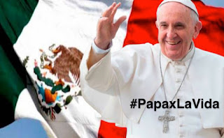

# Exige defender la vida humana en México, ¡te imploramos Papa Francisco!
México padece hoy, como nunca, una incesante estela de dolor, sangre y muerte que parecen no tener fin. El Papa podría darnos ánimo, esperanza y exhortarnos a velar por la vida humana.

 

Por una parte, desde que en 2007 la Asamblea Legislativa del Distrito Federal (ALDF) despenalizó el aborto hasta las 12 semanas de embarazo en la Ciudad de México, hasta diciembre de 2015 se han realizado **más de 152,501 asesinatos de bebés**. La Encuesta Nacional de Salud y Nutrición ha reportado 33 abortos por cada mil embarazos, mientras que el promedio en el mundo es de 29 por cada mil . Y, por la otra, el País ocupa el tercer lugar con mayor número de víctimas mortales en el mundo a causa de conflictos armados, después de Siria e Irak (de acuerdo con el Instituto Internacional de Estudios Estratégicos (IISS). Así, entre 2007 y 2014 **murieron más de 164,000 civiles** (frente a 103,000 muertos en Afganistán e Irak). Leer [nota](https://www.abc.es/internacional/20150811/abci-guerra-narco-muertos-irak-201508101829.html).

En otras palabras, desde casi una década para acá, tanto **el seno materno como las calles ya no son seguras para nadie**. Los mexicanos podemos morir antes de nacer porque la ley aprobada por la mayoría de los partidos políticos lo permite, o bien, porque después de nacer las balas del crimen organizado lo deciden. Sí, ley o balas, políticos o delincuentes, sufrimos un azote diabólico tal que clama justicia al Cielo.

Sumado a lo anterior enfrentamos como nación **problemáticas** agudas como el comercio humano (trata de blancas y secuestro infantil), la corrupción rampante, la pobreza extrema, el desempleo, el descrédito de la autoridad pública, la caída del precio del barril de petróleo, la devaluación histórica del peso frente al dólar, etc., etc. 

También, cabe decir, sufrimos **una severa crisis moral, a la par de una indiferencia y pérdida progresiva de la fe** producto del asedio de las sectas, la deteriorada imagen del clero y el movimiento herético New Age. (El porcentaje de católicos en México cayó, de 98.2% en 1950, a 82.7% en 2010 según el Instituto Nacional de Estadística, Geografía e Informática, INEGI). Han sido los jóvenes quienes particularmente se han alejado de la Iglesia.

**Ante este somero pero duro contexto socio-político, cultural y económico** en el que recibiremos al Papa Francisco en México con motivo de la gira pastoral del **12 al 17 de febrero**, vemos la oportunidad formidable de que el **Vicario de Cristo** se pronuncie por defender la **vida humana** desde el momento de la concepción hasta la muerte natural. No hay otro líder mundial hoy que, poseedor de un gran carisma, liderazgo y mandato evangélico, tenga la prerrogativa o estatura moral y el valor de expresarlo así al gobierno federal, a la jerarquía eclesiástica, a los laicos y a todos los mexicanos.

**Y más aún, cuando previo a su visita papal el Jefe de Gobierno de la Ciudad de México** (antes Distrito Federal), Miguel Ángel Mancera, expresó abiertamente su preocupación y deseo de que en la próxima redacción de la Constitución Política de la Ciudad de México -cuya reforma política fue aprobada el 16 de diciembre de 2015 por el Congreso- se mantengan el "derecho" de las mujeres a abortar y las uniones homosexuales. Será él quien entregue las Llaves de la Ciudad al Pontífice, ¿no les parece absurdo, o bien, cuestionable dada su postura anti-vida? Como a él, a muchos otros políticos solo les interesa la fotografía con Francisco y no una conversión al Señor.

**Nos encontramos en un momento histórico muy importante para el País.** Necesitamos urgentemente los mexicanos -en palabras de SS Juan Pablo II en su Encíclica Centesimus Annus- emprender un decisivo "cambio de mentalidad, de comportamiento y de estructuras" si queremos en verdad como Nación no solo recuperar el valor de la vida humana, sino fortalecer nuestra Fe en Cristo para encarar mejor los desafíos actuales y los que vendrán. Creemos que será justamente el Papa Francisco quien nos motive e invite nuevamente a "remar adentro", nos despierte del marasmo, nos llame a vivir la misericordia, avive nuestra Esperanza, nos recuerde que sin Cristo nada podemos hacer, y nos recuerde que **la Virgen de Guadalupe desea que los mexicanos sean realmente fieles a Dios** (a sus Mandamientos y Palabra), pues ella sufre enormemente viendo a tantos hijitos suyos sufrir y morir. (Ya hay una fuerte advertencia suya al Clero mexicano de lo que pasaría aquí de no atenderse su angustiante llamado; podría ser la última oportunidad. [Ver](https://sagradoscorazones.wixsite.com/apostolado#!blank/wj28e) ).

Oremos, recibamos al Papa con cariño y gritemos todos: "México católico ¡siempre fiel a Dios!"

#PapaxLaVida   
