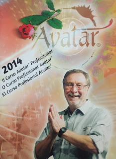

# El peligro ocultista del Curso Wizard Avatar
Es un tipo de cursos de superación personal de tinte psicológico-espiritual.
Sin tomar cuestionamientos en la Internet al fundador de los cursos Avatar, **Harry Palmer**, por motivos de estafa, "lavado de cerebro", enriquecimiento, falsedad de profesión, etc. -provenientes de sus ex alumnos- la mayoría de estos testimonios omiten señalar un aspecto sustancial de su enseñanza: el **ocultismo**.

## Origen
**Harry Palmer**, norteamericano, perteneció 15 años a la **Iglesia de la Cienciología** (fundada por Robert Hubbard, autor del libro "Dianética"). Ingresó a la secta en 1972 -en pleno apogeo del movimiento New Age- y estuvo al frente de la Misión Elmira hasta su salida por problemas legales con Hubbard. Así, en 1986 funda Avatar y con su esposa se lleva con él conceptos "cienciólogos" como "identidad", "Rundown" y "handling", entre otros, para sus nuevos cursos.

Palmer aseguró que concibió Avatar luego de un "trance" en el cual le fueron revelados sus preceptos. Asimismo, cree en la existencia de una Confederación Galáctica y la influencia extraterrestre en nuestra vida.

**Avatar está presente hoy en México** reclutando "adeptos" bajo el sistema de negocio piramidal (no confundir con el sistema multinivel) es decir, bajo un sistema de ganar-ganar o recompensa económica por cada nuevo aprendiz inscrito a sus onerosos programas (solo uno de sus cursos cuesta USD $ 7,000.-, o sea $129,500.- pesos a un tipo de cambio de hoy de $18.5 por dólar), sin considerar los gastos de hospedaje y transportación a Willingen, Alemania, u Orlando, Florida (centros importantes de enseñanza).

## Programa y cursos
**Avatar se presenta a sí mismo en su publicidad como** "*el programa de autodesarrollo más puro y más poderoso disponible. Es una serie de ejercicios experienciales que te habilitan a redescubrir tu ser y alinear tu conciencia con lo que quieres lograr. Experimentarás tus propios descubrimientos y revelaciones únicas. Nadie te dirá qué creer ni quién eres. Eres tú descubriéndote a ti mismo*". Más adelante dice: "La meta del curso de tres secciones es guiarte en una exploración de tu propio sistema de creencias y equipararte con las herramientas para modificar esas cosas que deseas cambiar. El Curso Avatar abre una ventana al funcionamiento interno de tu propia **conciencia**". 

Al respecto, **el movimiento Nueva Era adora el concepto "conciencia"** así, lo encontramos en un sin fin de artículos, publicaciones, libros, cursos, conferencias, etc. de la mano con "nueva espiritualidad", "vibración cósmica", "energía universal", "buenas vibras" utilizados siempre por grupos gnósticos, centros de superación personal, organizaciones esotéricas y neopaganas, etc. Podría tratarse de una coincidencia con Avatar, pero la revisión puntual de sus materiales impresos lo confirman: hay inspiración **New Age** desde su origen.

¡Y vaya que le interesa el término cuando propone una **"civilización planetaria iluminada"!**

En sus tres Secciones de cursos (básicos) Avatar se enfoca precisamente a su desarrollo:
- Sección I: El Taller ReSurgiendo. Técnicas para la Exploración de la Conciencia
- Sección II: Los Ejercicios. 
- Sección III: Los Recorridos

En su **"Sección V de los Materiales Avatar"** de dicho curso (un libro de más de 200 páginas) y Parte V titulada "el paradigma de entidades" (páginas 154 a 181) nos llevamos una tremenda sorpresa: 

* Se habla del **espiritismo** clásico 
* Se identifican "tres planos de la Realidad: físico, astral y mental"
* Se añaden "cuatro planos superiores: 4) plano **Búdico**, nirvánico, o monádico, 5) plano átmico o de la reunión espiritual, 6) adi o plano del espíritu planetario - al espíritu de la tierra se le llama con frecuencia Gaia, 7) anupadaka, unidad divina, o el plano de logos"
* Ubica a los difuntos en el "plano astral y cree en la reencarnación: "... el espíritu interactúa con su familia y prepara un representante para la reencarnación o evolución continuada"
* Sugiere la búsqueda del "plano astral" por el participante: "Normalmente cuando despiertas de lo físico a lo astral, estás rodeado por representaciones, creaciones y entidades...". "Las curaciones astrales son todavía un arte obscuro sin embargo poderoso. El Ejercicio del Serio es en realidad un proceso astral. El plano astral es donde terminas después de un exitoso Manejo Avatar del Cuerpo"
* Cita como "percepción astral" el "Tercer Ojo" y habla de "las comunicaciones con otros seres, cuando suceden...": "En cualquier contacto con seres astrales desencarnados (entidades), se aconseja fuertemente que no suspendas tu escepticismo".

## Opinión
Los términos **"astral", "Búdico", "Gaia", "reencarnación", "entidades", "Tercer Ojo", I-Ching** son igualmente utilizados por la Nueva Era (que ya he explicado en mis libros y en este blog), y pertenecen tanto al orientalismo (creencias budistas e hindúes) como primordialmente al mundo del ocultismo. 

**La Iglesia Católica rechaza** totalmente en su doctrina la reencarnación; niega la existencia de otras deidades que no sea Dios Padre, Dios Hijo y Dios Espíritu Santo (no existe "Gaia" que es mitología griega); afirma que los muertos van al Cielo, al Purgatorio o al Infierno y no al "plano astral"; advierte sobre evitar el contacto con las "entidades" porque son espíritus malignos; sabe, por expertos, que abrir el Tercer Ojo puede provocar la activación de poderes paranormales o facultades psíquicas extranormales (telepatía, telequinesis, precognición, retrocognición, "ciencia", etc.) porque se arriesga a sufrir ataques demoníacos (obsesiones, compulsiones, vejaciones, posesiones). ¿Exagerado? ¡No! Consulte mi libro y entenderá mejor todo esto.

No es casual que, luego de los cursos básicos y de **Wizard**, los alumnos de Avatar se comporten arrogantes (creyéndose semi dioses o "dioses" al pensar que pueden ser "creadores"), muestren celo fanático, rechacen escuchar opiniones distintas, riñan con sus padres (al sentirse totalmente independientes), abandonen la fe católica (o sostengan que es compatible con Avatar, lo cual es equivocado), etc.

## Conclución
1. **Tienen sus raíces en concepciones sectarias** (Cienciología), gestadas en el movimiento hippie o "flower generation" (New Age)
2. **Mezclan en sus cursos pseudopsicología, orientalismo y espiritismo** bajo el celofán (pretexto) del desarrollo de la conciencia
3. **Preparan a los alumnos a la búsqueda de comunicación con los demonios** (posesión demoníaca) con graves riesgos a su vida
4. **Lucran con la buena fe** e ingenuidad de las personas que desean superar sus problemas
5. **Son incompatibles con la fe católica** dada su carga esotérica y espiritista (ocultismo)
6. **"Producen" personas soberbias** que creen traerán realmente la paz a la Tierra

**Jaime Duarte Mtz.** *es licenciado en Relaciones Internacionales. Maestro en Ingeniería en Imagen Pública. Es catedrático, bloggero, consultor privado e investigador; ha estudiado el fenómeno New Age por más de 16 años, para lo cual fundó en 2012 el CISNE y ha impartido conferencias en México y en el extranjero a más de 40 mil personas. Es autor de cuatro libros al respecto.*