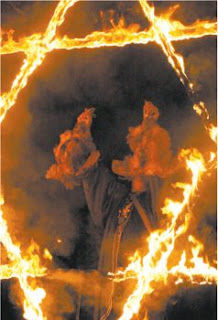

# Brujería, arma secreta de políticos

El Universal, 07 marzo 2009. Erick Viveros, corresponsal

**VERACRUZ**, Ver.— Para el **chamán Félix Oseguera**, originario de Santiago Tuxtla, en tiempos electorales, **la santería y la brujería** cobran auge en la región selvática de los Tuxtlas, al sureste de la entidad veracruzana, hasta donde acuden **políticos para demandar “trabajos”** que les permitan asegurar candidaturas.

"Especialista en **“ciencias ocultas”**, refiere que en cada **proceso electoral**, local o federal, requieren de sus servicios muchos aspirantes para desempeñar cargos públicos o de elección del estado y del país, **muy famosos algunos de ellos**, asegura.

“Vienen en busca de **rameadas, limpias y buenas vibras** para sus precampañas y campañas rumbo a los **comicios de este año**”, dijo en entrevista Oseguera.

"Todos demandan **“amarres políticos”** para tener suerte en sus carreras políticas. Llegan y dicen: “Soy precandidato, me voy a lanzar y quiero que me eches la buena vibra”, explicó uno de los chamanes, según trabajo solicitado de uno de sus clientes.

[...] el conjuro de las fuerzas oscuras en las **misas negras**, encabezadas por **Satán y la Santa Muerte**."

Ver más en: [Aqui](http://www.eluniversal.com.mx/primera/32608.html)