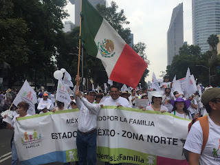

# ¡Nace en México el movimiento nacional cívico por la Defensa de la Familia!
**Tras las inéditas e históricas marchas del día 10 de septiembre y del 24 de septiembre en México**, en las que participaron de manera pacífica, ordenada, alegre y respetuosa dos millones de personas en más de 32 estados, 130 ciudades y 10 países en solidaridad, el Frente Nacional por la Familia (FNF que agrupa a más de mil organizaciones cívicas, católicas) y la Unión Nacional Cristiana por la Familia anunciaron la constitución del movimiento cívico permanente por la Familia.

  

De esta manera, el FNF y la UNCF reiteraron en un comunicado tras la impresionante marcha del sábado 24 de septiembre (ver abajo) **su rechazo a la iniciativa presidencial por la legalización de los "matrimonios homosexuales"** en la Constitución mexicana. Pidió al Presidente **Peña Nieto** una reunión para conversar sobre el tema, aprobar en cambio la iniciativa ciudadana para fortalecer la familia y crear el Instituto Nacional de la Familia.

Mira aquí fotos del extraordinario evento: https://www.aciprensa.com/noticias/videos-y-fotos-mas-de-400-mil-en-marcha-por-la-familia-en-mexico-17977/

  

**El Papa Francisco, incluso, se sumó también a la defensa de la vida y la familia**, en su mensaje dominical del angelus. (Incluso, expresó su dolor por los casos de tres sacerdotes asesinados. (Ver video abajo).

**México está despertando** así de un prolongado letargo; es el comienzo de una nueva etapa de conciencia y participación en nuestro País, donde decimos ¡ya basta! a los intereses antidemocráticos y perversos provenientes de la cúpula del poder político nacional y de organizaciones internacionales que desean a toda costa imponer su agenda nefasta dirigida a destruir la vida, la fe y la familia.

  
**Esteban Arce, conductor de Matutino Express de Televisa**, fue veraz al mostrar lo que realmente sucedió en la marcha: http://noticieros.televisa.com/foro-tv-matutino-express/2016-09-26/gran-marcha-familia/

A continuación algunos videos.
Sobre la marcha del 24/sep:

<iframe width="560" height="315" src="https://www.youtube.com/embed/6PFsvg_4QUE" title="YouTube video player" frameborder="0" allow="accelerometer; autoplay; clipboard-write; encrypted-media; gyroscope; picture-in-picture" allowfullscreen></iframe>

Sobre el mensaje solidarios del Papa Francisco...

<iframe width="560" height="315" src="https://www.youtube.com/embed/fPqcTYz750A" title="YouTube video player" frameborder="0" allow="accelerometer; autoplay; clipboard-write; encrypted-media; gyroscope; picture-in-picture" allowfullscreen></iframe>

Sobre cómo la ideología de género y el aborto forman parte de una misma agenda que pretende reducir la población mundial y donde la Iglesia Católica estorba a sus planes...

<iframe width="560" height="315" src="https://www.youtube.com/embed/j3h8_xKJigQ" title="YouTube video player" frameborder="0" allow="accelerometer; autoplay; clipboard-write; encrypted-media; gyroscope; picture-in-picture" allowfullscreen></iframe>

Comparte por favor este artículo entre tus conocido a fin de que estén bien enterado e informados y no se dejen engañar por los medios de comunicación y líderes de opinión que intentan minimizar o desprestigiar nuestra causa y movimiento.

  
Por Jaime Duarte Mtz., Director del CISNE.  
<https://www.cisne.org.mx>  
**@CISNE_2012**