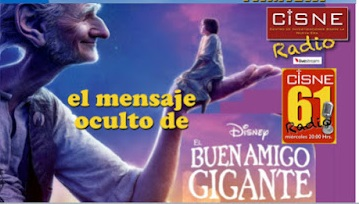

# El lado oscuro de la película El Buen Amigo Gigante
La creatividad para influir de manera negativa en la mente de nuestra niñez del imperio más poderoso del mundo del entretenimiento no tiene límites. La gran fábrica “donde los sueños se hacen realidad”; **Disney, siempre nos sorprende con ‘decibeles’ cada vez más subidos en forma, fondo y tono**, y este año ha sacado toda una serie de películas que llevan en deterioro la pur
eza e inocencia de los más pequeños de la casa.
En esta ocasión no ha dejado cabida a la especulación, suposición o perspicacia para algunos de nosotros que nos entretenemos analizando sus creaciones para denunciar **sus siniestros y descarados planes para adoctrinar a nuestros hijos en temas oscuros, esotéricos, sexuales y de muchas ideologías que son contrarias a principios y valores, la moral y la ética o a sanas costumbres** que nuestros padres o abuelos inculcaron en nosotros y que esta empresa quiere destruir y enviar al baúl de los malos recuerdos.

  

  
Por Jaime Duarte Mtz., Director del CISNE.  
<https://www.cisne.org.mx>  
**@CISNE_2012**