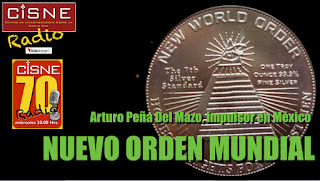

# Tío masón del presidente Peña Nieto impulsa el Nuevo Orden Mundial

Investigación del **Centro de Investigaciones sobre la Nueva Era (CISNE)** informa y denuncia cómo, en conferencias realizadas en escuelas de México, el **Ing. Arturo Peña Del Mazo** (tío del actual Presidente de la República) promueve quitar a la Iglesia Católica del camino para empujar un cambio global: el llamado "Nuevo Orden Mundial".

¡No permitamos semejante atropello de la Masonería anticristiana!

<iframe width="560" height="315" src="https://www.youtube.com/embed/Mo9IkdY9jAk" title="YouTube video player" frameborder="0" allow="accelerometer; autoplay; clipboard-write; encrypted-media; gyroscope; picture-in-picture" allowfullscreen></iframe>

  
Por Jaime Duarte Mtz., Director del CISNE.  
<https://www.cisne.org.mx>  
**@CISNE_2012**