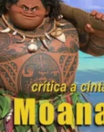

# Tío masón del presidente Peña Nieto impulsa el Nuevo Orden Mundial

**Eréndira Duarte Martínez**, investigadora del Centro de Investigaciones sobre la Nueva Era (CISNE), analiza ahora la cinta "Moana" de la compañía Disney. En el siguiente video de CISNE Radio expresa su descubrimiento... ¡ocultista!

<iframe width="320" height="266" src="https://www.youtube.com/embed/LvGtkpUtiG0" title="YouTube video player" frameborder="0" allow="accelerometer; autoplay; clipboard-write; encrypted-media; gyroscope; picture-in-picture" allowfullscreen></iframe>

  
Por Jaime Duarte Mtz., Director del CISNE.  
<https://www.cisne.org.mx>  
**@CISNE_2012**