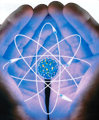

# Medicina cuantica verdad o mito?

**Antaño, cuando algo no se entendía, se les achacaba a los dioses. Hoy los gurús de la new age invocan a la física cuántica para justificar toda clase de afirmaciones insólitas sin molestarse en demostrarlas. Pero los gurús están mal informados: la física cuántica no es lo que ellos creen.**

*"Hasta cuándo vas a seguir inyectándote insulina?”*, pregunta al vacío un cartel pegado en la ventana de una casa del barrio de Coyoacán, en la Ciudad de México. Luego **el letrero ofrece a los diabéticos curarlos sin medicamentos por medio de la “medicina cuántica”**.

En la película **¿Y tú qué @#√!∗ sabes?**, reciente éxito de taquilla, unos físicos, un quiropráctico, una bioquímica iluminada y una médium nos aseguran que cada cual es el arquitecto de su propio destino. **A mí eso me lo dijo mi abuelita hace muchos años**, pero estos eruditos añaden que le debemos a la mecánica cuántica el poder de tomar las riendas de nuestras vidas.

"Soy físico y aprendí algo de mecánica cuántica en la Facultad de Ciencias de la Universidad Nacional Autónoma de México. La mecánica cuántica es la física de lo muy pequeño: átomos, moléculas y demás. Como un paciente de diabetes no es ni un átomo ni una molécula y como la mecánica cuántica que usamos los físicos no tiene ni remotamente que ver con la dirección de la vida de nadie, me puse a investigar de dónde habrían sacado los habitantes de esa casa y los creadores de esa película la **peregrina idea de que la mecánica cuántica sirve para curar la diabetes y darle rumbo a la existencia**. He aquí lo que encontré.

## El error de Fritjof Capra

En los años 70 y 80 el físico y místico austriaco **Fritjof Capra publicó unos libros**, entre ellos uno titulado El tao de la física, en los que encontraba parecidos entre ciertas ideas relacionadas con la mecánica cuántica y las doctrinas de las **religiones orientales**. No sé si era la intención de Capra, pero muchos de sus lectores interpretaron sus libros como prueba de que la ciencia moderna explicaba y daba sustento a la religión, por lo menos a las de oriente.

**Además de este equívoco**, quizá involuntario, Capra cometió otro menos inocente. Al explicar el extraño comportamiento de **objetos cuánticos como los electrones**, que a veces se comportan como ondas y a veces como partículas, Capra observa, correctamente, que obtener uno u otro comportamiento depende de los aparatos que usemos para medir: si medimos ondas obtendremos comportamiento ondulatorio, si buscamos partículas, obtendremos partículas. De modo, añade Capra sin alejarse mucho de la ortodoxia cuántica del día, que las propiedades de los electrones dependen en cierta medida de las decisiones conscientes del experimentador u observador. Puede ser. Lo mismo ocurre con el agua que sale de la ducha: que sea fría o caliente depende de nuestra decisión consciente de abrir uno u otro grifo (y será tibia si los abrimos en distintas combinaciones). **Pero luego Capra ejecuta un salto mortal deductivo, y sin avisarle al lector: ¡por lo tanto el electrón no tiene propiedades independientes de nuestra conciencia!"**

Extracto de Sergio de Régules (Físico prestigiado. Coordinador científico de la Revista ¿Cómo ves?, autor de varios libros científicos).  
Fragmento de "Cháchara cuántica y física cuántica", de ¿Cómo ves? (UNAM).  