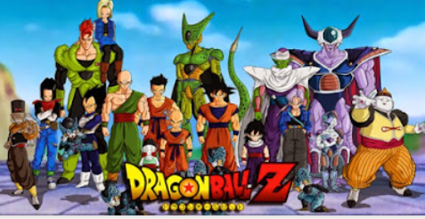

# Análisis de contenido de la caricatura
Con el propósito de orientar a padres de familia, sacerdotes, profesores y catequistas encargados de educar y formar a los menores de edad, tanto en la doctrina cristiana católica como cuidar de su salud mental, podemos asegurarles que esta serie de caricaturas animadas **no es apta para los niños por las siguientes 8 razones**

## NO SON CARICATURAS PARA NIÑOS NI EDUCAN A LOS ADOLESCENTES
´Dragon Ball Z´ (1986) del mangaka Akiro Toriyama, es una serie Anime del género Shonen, dirigido a adolescentes varones entre los 14 y 18 años de edad con escenas de gran colorido, mucha acción e historias que desde el primer capítulo impactan y atrapan a los menores de edad. Su contenido dista de las tramas simples con fantasía inocua que caracterizan al género *Kodomo*, dirigido a niños pequeños como lo fue *Astroboy* (1963-66) el niño androide que podía volar o de la inocente *Heidi* (1974) historia de una niña huérfana basada en una novela europea de 1880, sin dejar de mencionar a *Doraemon* (1999-2011) el gato robot cósmico del siglo XXII enviado al pasado para ayudar a Nobita.

## VIOLENCIA EXTREMA, DESTRUCCIÓN Y MUERTE
Frecuentes peleas con detalles de las heridas, sangrados, mutilaciones y muertes violentas de humanos y extraterrestres causadas por las golpizas, uso de armas y descargas destructivas con energía “ki”. Hay escenas que recrean asesinatos a balazos, devastación de ciudades y planetas, varones que propinan golpes a mujeres en torneos de combates cuerpo a cuerpo, y hasta el suicidio de una chica que se dio un tiro con pistola en la cabeza al jugar a la ruleta.

## MORBO Y PERVERSIDAD SEXUAL QUE AFECTA A NIÑOS Y ADOLESCENTES
Hay escenas con provocaciones sexuales y semidesnudos femeninos que atacan la pureza de los niños pequeños e incitan a los adolescentes a la lascivia - pecado que consiste en la predilección a los deseos carnales o lujuria desbordada-, desde el inicio de la serie, principalmente por **Bulma** (nombre que deriva de “bragas” = pantaleta), muchacha astuta y colérica que le muestra sus piernas y calzón al niño **Goku**, al cual le permite que la toque allí si le da a cambio una esfera del dragón. Otro ejemplo de humorismo sexual insano es el voyeurismo que padece el **maestro Roshi**, anciano pervertido que siente placer al espiar a muchachas duchándose o mirando con libinidosidad a las mujeres como *Launch* o la frívola y voluptuosa Maron, quien a menudo viste con minifaldas y en la playa usa su traje de baño con una tanga que no cubre sus asentaderas. Además de tocarles sus senos y trasero sangra por la nariz.

## ANTIVALORES QUE ATENTAN CONTRA EL AMOR Y VIRTUDES CRISTIANAS
Es común oír y ver en cada capítulo que los personajes se insulten, expresen odio, deseos de venganza, sarcasmos, señas obscenas y actúen con crueldad y autoritarismo a favor del mal. Los héroes de los niños y adolescentes cuyas conductas tienden a imitar, ya no son personajes con virtudes cristianas, sino ídolos caricaturescos que manipulan las fuerzas de la naturaleza para arreglarlo todo con gran poder de destrucción.

## ESOTERISMO ORIENTAL QUE VA PERMEANDO EL OCCIDENTE CRISTIANO
Se recrean con humorismo las almas de los muertos y el infierno, creencias y prácticas del hinduismo, budismo y sintoísmo (religión primitiva de Japón), para activar la energía vital o “ki” (chi en chino) y abrir el **“tercer ojo”** con asanas (señas), posturas y mantras retomadas de la Yoga como lo hacen Piccolo -extraterrestre con aspecto demoníaco- y Ten Shin Han, tricople protector de brujos, monjes y hechiceros. Al igual que hacen los saiyajines Goku y Vegueta, todos los guerreros se cargan son “energía cósmica vital” y comunican telepáticamente con los kami (espíritus), dioses vigilantes de planetas y la galaxia (kaiosama), junto a los maestros en artes marciales les enseñan “técnicas” para combatir: Energía Kaio-ken, Kame-Hame-Ha, Genki-dama, a transformarse y fusionarse.

## FASCINACIÓN POR LOS PODERES MÁGICOS
Significa que los personajes centrales ejercen una atracción irresistible en los menores de edad a través de la fantasía y la trama con efectos visuales y auditivos que penetran su mente inconscientemente, detonando su deseo de cargarse con “energía” y poseer “poderes mágicos” que los separan de Dios y los abren a la acción de espíritus inmundos.

##  SIMBOLOGÍA OCULTISTA 
La Estrella roja de cinco puntas o Pentagrama dentro del círculo mágico que hay en las 7 esferas del dragón y el Hexagrama, que se forma cuando estas giran, son símbolos usados en rituales de magia y en diversas vertientes del ocultismo, retomados por la Masonería -sociedad secreta anticristiana de corte iniciático- donde se gestó la anticultura de la ´Nueva Era´, para invocar a Lucifer y Satanás y acabar con la Iglesia.

## SÁTIRA DE SATANÁS, BRUJAS Y EL INFIERNO CON SERES HUMANOS, EXTRATERRESTRES Y BIO-ANDROIDES DE ASPECTO DEMONÍACO
Son varios los personajes con aspecto y/o nombres demoníacos, como el karateka **Mr. Satán** y su hija **Videl** (Devil = demonio) que viven en ciudad **Satán**. **Picollo Daimao**, descrito como el “rey maligno de otro mundo”, extraterrestre venido del planeta Namek que parece brujo. **Dabura** (de Abracadabra), muy parecido al Diablo con dos cuernos cortos en la cabeza, barba de chivo y la letra “M” de magia en su frente, bajo el control del hechicero **Babidi**. Uranai Baa es una bruja adivina con el típico vestido y sombrero de pico negro. **Shenlong**, es el dragón (shen significa “deidad” o “espíritu” y long es “dragón” en chino; Shenron en japonés), es un ser legendario de Oriente que en el cristianismo se vincula a Satanás mencionado en la Biblia como la serpiente antigua que tentó a Adán y Eva o el **Dragón Rojo** (drákon en griego significa “serpiente”) del Apocalipsis

### Conclusion
´DRAGON BALL Z´ ES IMPLÍCITAMENTE PERVERSA, USA LA FANTASÍA, PICARDÍA, VIOLENCIA Y PERVERSIÓN PARA ATENTAR CONTRA LA INOCENCIA DE LOS NIÑOS Y PERTURBAR A LOS ADOLESCENTES.

Censurada en los E.U.A., Australia y varios países de Europa, fueron cortados varios episodios excesivamente violentos, las escenas lascivas y antimorales, además de un suicidio que las hace no aptas para niños y adolescentes. **En contraste, ¡los niños en México pueden ver las 3 sagas en el canal 5 de T.V. sin cesura ni corte alguno!**

Para quienes no llevan una vida espiritual cristiana apegada a la sana doctrina católica y una educación sexual correcta acorde a su edad, éste análisis podría parecerles moralino, anticuado o tal vez exagerado. Sin embargo, no se puede negar que muchas series de caricaturas japonesas y norteamericanas son el medio por el cual, nuestros niños y adolescentes son atacados por diversas vertientes que conforman la anticultura ´Nueva Era´, incluyendo el esoterismo, el satanismo y las tendencias y desviaciones sexuales agrupadas en el movimiento LGBTii (siglas que designan colectivamente a lesbianas, los gays, los bisexuales y las personas transgénero e intersexuales), que la errónea teoría sobre la ideología de género intenta implantarse en las escuelas.

<iframe class="scribd_iframe_embed" data-aspect-ratio="0.7729220222793488" data-auto-height="false" frameborder="0" height="600" id="doc_69368" scrolling="no" src="https://www.scribd.com/embeds/349157624/content?start_page=1&amp;view_mode=scroll&amp;access_key=key-xIAwH07RiDzK6yiGzQms&amp;show_recommendations=true" width="100%"></iframe>

Véase y descárguese también el análisis completo aquí:  
http://www.mediafire.com/file/msstoruorqhti63/CISNE_AnálisisDragonBallZ_Rodolfo.pdf 

  
Por Jaime Duarte Mtz., Director del CISNE.  
<https://www.cisne.org.mx>  
**@CISNE_2012**
