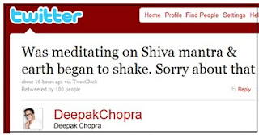

El pasado temblor de 7.2 grados en escala de Richter, ocurrido el pasado 4 de abril de 2010 en Mexicalli y sur de California, fue resultado de la meditación en el mantra Shiva de Deepak Chopra, médico indio, según afirmó en su Twitter el propio gurú espiritual y uno de los más importantes promotores ideológicos de la Nueva Era.

Shiva, en la mitología hindú, es una de las más importantes deidades de la República de la India; esposo de Parvati ("energía"), significa "terror de los demonios".

Chopra incluso se disculpó con los afectados por el sismo. He aquí su afirmación en inglés:

**“Was meditating on Shiva mantra & earth began to shake. Sorry about that.”**

A ver: ¿Lo disculpamos entonces por el daño provocado a los afectados del temblor al excederse en su poderosa "meditación trascendental" y le exigimos así la reparación de los daños correspondientes? ¿Lo perdonamos por su humor negro ante el sufrimiento real de quienes perdieron su casa y algún ser querido? O bien, ¿lo disculpamos mejor por pretender burlarse de nuestra inteligencia?

He ahí la opinión de un hombre que se proclama verdadero "humanista", interesado en el crecimiento espiritual (hindú), crítico del catolicismo y preocupado por un mundo mejor (New Age).

¡No se deje engañar más!  