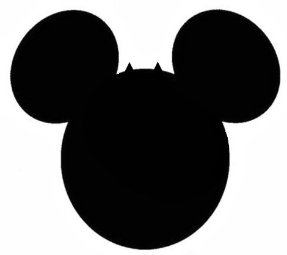

Sí, sé que el titulo de este post te sonó raro e inverosímil, pero quiero decirte que **algo muy extraño está pasando -y ha pasado- en el imperio del entretenimiento** mundial desde su fundación hasta el día de hoy.

Si bien es cierto que en sus cintas e historias con las que crecimos podemos encontrar un **mundo maravilloso de ilusión y fantasía**, con sus princesas hermosas, héroes valerosos y música de fondo estupenda, también descubrimos un lado obscuro y misterioso.

 

Aunque yo mismo me había negado a aceptar esta última aseveración cuando me lo comentaron, mi investigación me ha llevado a confirmar -no sin cierto pesar- que **Disney ha sido uno de los medios más poderosos de difusión del ocultismo** entre la niñez y juventud, aún antes del éxito de Harry Potter y de El Crepúsculo. A través de sus películas, caricaturas, peluches, juguetes, etc. es posible detectar la presencia de brujería, hechicería, magia negra, vudú, santería, espiritismo y satanismo... ¡Sí! Tanta recurrencia de la compañía en el tema no es una casualidad. Sería necedad negar la existencia de tantas evidencias documentales y testimoniales.

Pero eso no es todo, también podemos encontrar entre algunos de sus personajes, parques de diversiones, personal y series de TV, alusiones, imágenes y mensajes dirigidos a promover la **homosexualidad y el aborto** en su audiencia. 

Por ejemplo, el 28 de junio, **"Día Internacional del Orgullo Gay"**, el parque de Disney en Orlando, Florida, permite el acceso gratuito al mismo a todas las personas homosexuales, lesbianas, transexuales o bisexuales. Y hay más ejemplos de sus preferencias sexuales en la naturaleza de su sindicato, sus directivos y personajes. (Ejemplos: **Mulan**; el mago vudú **Dr. Facilier**, en "La Princesa y el Sapo"; **Úrsula**, en "La Sirenita"; **Hades**, en "Hércules", o El Genio, en "Aladino")

Hace unos años se desató una nueva polémica porque en el programa infantil **"Good Luck Charlie"** de Disney Channel, una pareja de mujeres (madres) del mismo sexo, aparecieron en la pantalla. (Ver crítica aquí). Pero este programa de entretenimiento de TV de paga no fue el primero, pues la empresa lanzó años atrás **"The Ellen Show"**, en el cual su famosa y carismática conductora Ellen DeGeneres (sic) es declaradamente lesbiana. 

Ya en este blog había advertido de cómo Marvel y DC Comics anunciaron en 2013 -cada empresa por su parte- que tanto **Ashtor de los X-Men** como **Linterna Verde** ¡soy gays!

Y eso no es todo: ¿Qué tal la burla que la empresa Disney hace de la Iglesia en La Sirenita con el obispo que casa a la feliz pareja? Mira [aquí](https://www.youtube.com/watch?v=sH38aNt4hOs) el video. O bien, ¿sus alusiones al sexo y fornicación? Mira ahora esto [aquí](https://www.youtube.com/watch?v=BKCXvlj73Ig). En 2008 la prensa internacional publicó la información de la "Orgía Disney", un cartón que causó escándalo porque la empresa le instruyó en 1967 a Wally Wood dibujar sus personajes "erotizados".

Marcas "prestigiosas" como Disney, gracias al uso de sus medios de comunicación y de la industria del cine, ejercen una influencia impresionante en la mente del público. De este modo la **"cultura de la muerte"** continua su incesante avance con gran ímpetu o vigor, y logra seducir, aún, a los laicos "formados" de la Iglesia.

A continuación le mostramos las pruebas visibles (a través de fotos y cintas) que confirman  que **Disney ha sido la más poderosa compañía del entretenimiento mundial promotora del ocultismo, el esoterismo, el aborto y la homosexualidad**

<iframe width="560" height="315" src="https://www.youtube.com/embed/CVbbqY6wF4k" title="YouTube video player" frameborder="0" allow="accelerometer; autoplay; clipboard-write; encrypted-media; gyroscope; picture-in-picture" allowfullscreen></iframe>

   

**Moana**
<iframe width="320" height="266" src="https://www.youtube.com/embed/LvGtkpUtiG0" title="YouTube video player" frameborder="0" allow="accelerometer; autoplay; clipboard-write; encrypted-media; gyroscope; picture-in-picture" allowfullscreen></iframe>

 

Leer crítica a la cinta: ["Animales fantásticos"](/animales-fantasticos-opinion)

 

**"Los Descendientes"**
<iframe width="320" height="266" src="https://www.youtube.com/embed/nyzA-2umyBY" title="YouTube video player" frameborder="0" allow="accelerometer; autoplay; clipboard-write; encrypted-media; gyroscope; picture-in-picture" allowfullscreen></iframe>

 

Te invito a leer el siguiente documento, extracto del libro de tu servidor **"Nueva Era vs Buena Nueva"** (2007), donde brindo muchos ejemplos de este "increíble" nexo Disney-ocultismo. Seguramente abrirás los ojos y pensarás, dos veces, en qué ven tus hijos.

<iframe class="scribd_iframe_embed" data-aspect-ratio="undefined" data-auto-height="false" frameborder="0" height="600" id="doc_93594" scrolling="no" src="//www.scribd.com/embeds/205451947/content?start_page=1&amp;view_mode=scroll&amp;show_recommendations=true" width="100%"></iframe>

 
Por Jaime Duarte Mtz., Director del CISNE.  
<https://www.cisne.org.mx>  
**@CISNE_2012**