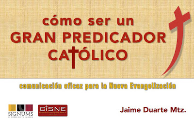
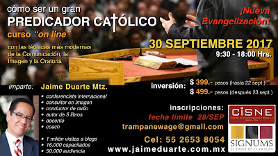
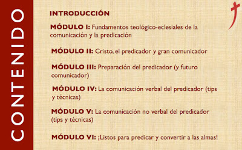

**El mandato misionero del Señor Jesús** sigue siendo vigente desde hace más de dos mil años: "Id por todo el mundo y proclamad la Buena Nueva a toda la creación..." (Marcos 16, 15- 18). 

Sin embargo, ¿te has puesto a pensar que pese a esta exigencia divina no sólo hacen falta en nuestra Iglesia Católica **más evangelizadores** sino más y mejores predicadores? Más aún nos urgen... ¡profetas!
 

Una de las razones por las cuales **no hay suficientes predicadores hoy** es porque no hay buenos comunicadores. ¿Por qué? Quizá porque no están preparados.

**A fin de ayudar a Cristo a extender su Reino de Amor y de Justicia** entre nosotros, de enfrentar los duros desafíos del siglo XXI y de colaborar en la Nueva Evangelización a la que nos invita la Iglesia, el CISNE en colaboración con SIGNUMS imagen y Reputación han diseñado un curso y taller para capacitar a nuevos predicadores que, bajo el Poder del Espíritu Santo, se conviertan con su unción en los grandes profetas de nuestro tiempo.

**Se trata de una capacitación especial, profesional y única en México**, que recoge lo mejor de las técnicas más modernas de la Oratoria y la Comunicación, dirigida a sacerdotes, religiosos y seglares (catequistas, maestros, formadores, etc.) que deseen fortalecer su comunicación personal a fin de atraer más almas al Señor, logrando así su "metanoia" (conversión).

¿Por qué no retomar aquellos consejos y "secretos" útiles de los más grandes oradores, entrenadores y conferencistas del mundo y ponerlos **al servicio del Evangelio?**

Es así como te invitamos a adquirir el curso **"Cómo ser un gran predicador católico"**, basado en los cursos "on line" realizados los día 22 de octubre de 2016 y 30 de septiembre de 2017.

**Para mayores informes** ponte en contacto con **Jaime Duarte Mtz.**
Tel. Cel. y WhatsApp: 55 2653 8054
E-mail: trampanewage@gmail.com

Inversión: $ 500.- pesos mexicanos (Dólares: $ 28.- USD)

<iframe width="320" height="266" src="https://www.youtube.com/embed/rJZD4rloJAw" title="YouTube video player" frameborder="0" allow="accelerometer; autoplay; clipboard-write; encrypted-media; gyroscope; picture-in-picture" allowfullscreen></iframe>

 

**"*Porque evangelizar no es gloria para mi, sino necesidad. ¡Ay de mi si no evangelizara!*"** (1a. Corintios 9, 16).

<iframe width="320" height="266" src="https://www.youtube.com/embed/OMgMfd91-cI" title="YouTube video player" frameborder="0" allow="accelerometer; autoplay; clipboard-write; encrypted-media; gyroscope; picture-in-picture" allowfullscreen></iframe>

 

Si no quieres comprar el curso, puedes adquirir solo mi libro de **"Comunicación eficaz..."** directamente con tu servidor en PDF, en $100.-; escríbeme a trampanewage@gmail.com y solicítamelo.

Mira el índice del libro [aquí](https://www.slideshare.net/JaimeDuarteMartnez/guia-comunicacion-eficaz-persuasiva-y-poderosa).

 
Por Jaime Duarte Mtz., Director del CISNE.  
<https://www.cisne.org.mx>  
**@CISNE_2012**