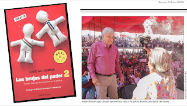

**Andrés Manuel López Obrador** ha buscado desde hace más de 15 años el apoyo de brujos para lograr el poder político en México. Con ello, el precandidato hoy de MORENA a la Presidencia de la República representa una amenaza seria a la Nación.

**Nuestro Señor dice en su Palabra:** *“Cuando hayas entrado en la tierra que Yahvé te da, no aprenderás a cometer abominaciones como las de esas naciones. No ha de haber dentro de ti nadie que haga pasar a su hijo o a su hija por el fuego, que practique la adivinación, la astrología, la hechicería o la magia, ningún encantador, ni quien consulte espectros o adivinos, ni evocador de muertos. Porque todo el que hace estas cosas es una abominación para Yahvé tu Dios y por causa de estas abominaciones desaloja Yahvé tu Dios a esas naciones a tu llegada.*

“Serás íntegro con Yahvé tu Dios. Porque esas naciones que vas a desalojar escuchan a astrólogos y adivinos, pero **a ti Yahvé tu Dios no te permite semejante cosa”**. (Deuteronomio 18, 9-14).

**"No practiquéis la adivinación ni la magia...** Si alguien consulta a los nigromantes y a los adivinos, y se prostituye con ellos, yo volveré mi rostro contra él y lo extirparé de su pueblo. Santificaos y sed perfectos; porque yo soy Yahvé, vuestro Dios". (Levítico 19, 26 y 20, 6-7).

¡Abre los ojos! ¡Piensa! ¡Fíjate por quién vas a votar! Visita: www.votocatolico.mx y decide mejor.

<iframe width="320" height="266" src="https://www.youtube.com/embed/wZpcwddrJus" title="YouTube video player" frameborder="0" allow="accelerometer; autoplay; clipboard-write; encrypted-media; gyroscope; picture-in-picture" allowfullscreen></iframe>

 

<iframe width="320" height="266" src="https://www.youtube.com/embed/4ttZI70030s" title="YouTube video player" frameborder="0" allow="accelerometer; autoplay; clipboard-write; encrypted-media; gyroscope; picture-in-picture" allowfullscreen></iframe>

 

Por Jaime Duarte Mtz., Director del CISNE.   
<https://www.cisne.org.mx>    
**@CISNE_2012**  