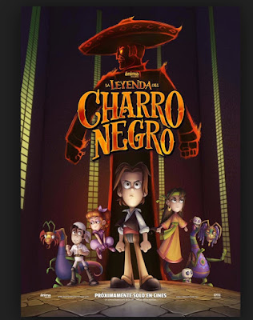

**Hemos registrado en los últimos años una proliferación alarmante de cintas de tinte ocultista**  producidas por diversas empresas productoras extranjeras -como Disney-, dirigidas especialmente al mercado infantil y juvenil. Películas como "Frankenweenie", "Los Mundos de Coraline", "Paranormal", "Hotel Transilvania", "Harry Potter", "El Crepúsculo", "El buen amigo gigante", "Eso", "Monster House", "Papá: soy una zombi", "El pequeño vampiro", "Coco", entre otras, son una **muestra evidente de una pertinaz "campaña" de Hollywood por aterrorizar-fascinar a las generaciones actuales** con las terribles consecuencias espirituales que ello implica: infestaciones, vejaciones, obsesiones, compulsiones y posesiones diabólicas; ¡asedio maligno!

Y todo ello sin mencionar aquí caricaturas, series nefastas de TV como **"Gravity Falls"** y videojuegos igualmente macabros.

El siguiente video, del **Lic. Roberto O'Farril** exhibido en su programa "Ver y Creer", aborda el tema del ocultismo en los niños y jóvenes:

<iframe width="810" height="455" src="https://www.youtube.com/embed/HeNyr2KcwtQ?list=PLavYacWR0JnKBctDUnESz3fxirsZoXrb8" title="YouTube video player" frameborder="0" allow="accelerometer; autoplay; clipboard-write; encrypted-media; gyroscope; picture-in-picture" allowfullscreen></iframe>

Por Jaime Duarte Mtz., Director del CISNE.   
<https://www.cisne.org.mx>    
**@CISNE_2012**  