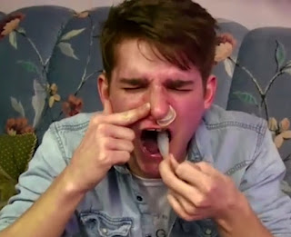

# ¡Alerta papás!
Con objeto de advertir a los padres de familia el **Centro de Investigaciones sobre la Nueva Era (CISNE)** presenta a continuación una breve compilación de videos sobre los actuales **retos absurdos, peligrosos y macabros** que están seduciendo a la juventud.

La información está contenida en los siguientes videos que hemos retomado de varios programas de CISNE Radio. Los "juegos" son "hadas del fuego", la "ballena azul", videojuego pornográfico de Batman, el "dead pose challenge", "boobluge", "choking game" y "eraser challenge", entre otros... También, añadimos el reto del condón en la cabeza ("condom challenge"), el "ice challenge" y el prenderse fuego ("fire challenge"), entre los más terribles.

  

<iframe width="320" height="266" src="https://www.youtube.com/embed/rmKgnhiKKhA" title="YouTube video player" frameborder="0" allow="accelerometer; autoplay; clipboard-write; encrypted-media; gyroscope; picture-in-picture" allowfullscreen></iframe>

 

Por Jaime Duarte Mtz., Director del CISNE.   
<https://www.cisne.org.mx>    
**@CISNE_2012**  