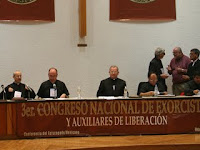

# En México hay 5 exorcismos cada día

**La Capilla de las Benditas Ánimas del Purgatorio, exclusiva para estos actos, se edificó en Colón, Querétaro, tras una inusual ola de posesiones.**

Al principio, el diablo empieza a gritar: “¡Cállate, cállate!”. Luego obliga a su víctima a agredir al sacerdote con golpes, patadas, escupitajos. Algunos hablan en lenguas antiguas. En casos extremos levitan o sangran.

Para contenerlos son necesarias varias personas, porque los poseídos cobran una fuerza inhumana.

Es un exorcismo. Un rito cada vez más frecuente en México, reconoce la Iglesia católica, que recientemente inauguró el primer recinto dedicado exclusivamente a combatir las andanzas de Lucifer en el país.

Se trata de la Capilla de las Benditas Ánimas del Purgatorio, construida en el municipio de Colón, Querétaro.

En ese estado se ha presentado una inusual ola de posesiones e influencias del demonio, señaló Rogelio Cano, rector de la Catedral de Nuestra Señora de los Dolores de Soriano, donde se ubica la capilla.

*Aumentaron los casos porque hay muchos grupos satánicos. Hemos visto posesiones diabólicas, y por eso la necesidad de contar con un lugar especial para los ritos*, dijo en entrevista el sacerdote.

Pero no sólo en Querétaro abundan los exorcismos. Datos de la Conferencia del Episcopado Mexicano (CEM) revelan que en el país se realizan hasta cinco ceremonias de este tipo al día.

Cada una de las 86 diócesis en que se divide la Iglesia en México tiene sacerdotes exorcistas.

[Capilla en Queretaro](https://www.noesis.com.mx/post/la-capilla-que-combate-posesiones-demoniacas-en-queretaro)