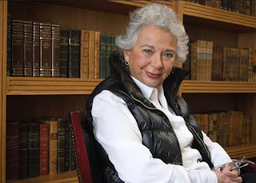

En voz de la futura Secretaria de Gobernación, **Olga Sánchez Cordero, Andrés Manuel López Obrador** (presidente electo de México) el pasado 1º de julio, anunció en menos de dos semanas que su gobierno aprobará la Ley de Voluntad Anticipada **(eutanasia)**, la despenalización del **aborto** y la legalización de las drogas en todo México.

Sabíamos que estos temas figuraban ocultamente en la agenda de su partido de izquierda **MORENA** (Movimiento de Regeneración Nacional) y que buscaría discretamente impulsarlos durante su futura administración, sin embargo, nos ha sorprendido la rapidez de su anuncio sin tapujos ni ambigüedades.

Es de esperarse, por tanto, que el nuevo gobierno impulse e instrumente jurídicamente la ideología de género en su sexenio. Temas como la aprobación de "matrimonios homosexuales" (bodas gay) y el "cambio de sexo" en los niños (plasmado en los libros de texto oficial de la Secretaría de Educación Pública), seguramente serán aprobados por el nuevo Congreso federal con mayoría morenista.

 
¡Es necesario orar y actuar!  

 

Por Jaime Duarte Mtz., Director del CISNE.   
<https://www.cisne.org.mx>    
**@CISNE_2012**  