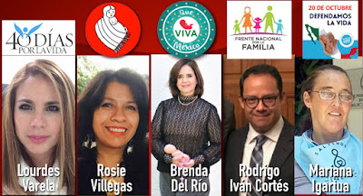
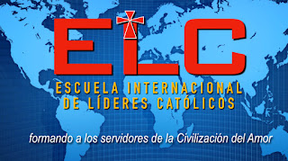

**Con el arribo al poder de un nuevo gobierno Legislativo y Ejecutivo en México**, a partir de septiembre y diciembre, que ha anunciado la legalización de la eutanasia, el aborto y las drogas, así como la intensión de extender los matrimonios del mismo sexo y de operar la "democratización de la familia", llamamos a todos los católicos y a los ciudadanos de buena voluntad, a informarse y participar en las distintas campañas que se están organizando para impedirlo.

 

## ¿Deseas colaborar con Cristo en la conversión y Salvación de las almas? 
Inscríbete y prepárate más en la Escuela Internacional de Líderes Católicos ("online"), pionera en el mundo. 

info [aqui](https://www.cisne.org.mx/elc-7gen/)
 

Por Jaime Duarte Mtz., Director del CISNE.   
<https://www.cisne.org.mx>    
**@CISNE_2012**