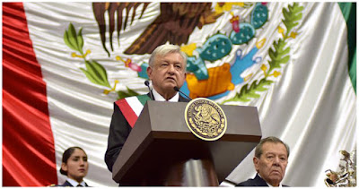

**Andrés Manuel López Obrador** tomó posesión como Presidente de la República el pasado 1º de diciembre, y en apenas dos semanas de haber asumido el cargo en México, ya lleva dos "ceremonias" pseudo indígenas New Age. 

Primer ritual levanta a la "serpiente emplumada" (Quetzalcóatl), y en el segundo solicita "permiso" a la (diosa) "madre tierra" (Coatlicue) para construir el Tren Maya.

Es una vergüenza para México que un mandatario participe en esta clase de eventos, dejando en claro que viola no solo la Constitución Política, sino también, el Primer Mandamiento de la Ley de Dios. 

Para nosotros no hay duda: **entregó simbólicamente al País al Demonio**. (Información confidencial revelada por un miembro de la Masonería, testigo de ese y otro ritual privado, nos lo confirmó).

Oremos por nuestra patria, pues estos actos, lo sabemos, "abren puertas" a las fuerzas infernales.

  

### Ver también
- [Católicos y política: López Obrador ha buscado a brujos para ganar Los Pinos](/obrador-y-susbrujos) 
- [AMLO buscará legalizar el aborto, la eutanasia y las drogas en todo México](/amlo-aborto-y-eutanasia)
- [AMLO ganó, ¿y ahora qué hacemos?](/gano-amlo)

Por Jaime Duarte Mtz., Director del CISNE.   
<https://www.cisne.org.mx>    
**@CISNE_2012**