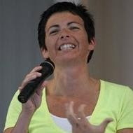

# De una secta satánica a monja, tras intentar asesinar a la que hoy es su superiora

**Michela, en la actualidad religiosa de la Comunidad Nuovi Orizzonti, tiene una vida de película. Abandonada por su madre cuando era un bebé, atrapada por una peligrosa secta satánica, convencida de la necesidad de asesinar a una monja por indicación de la sacerdotisa, que a la vez era su psiquiatra... Cuenta su testimonio en ReL con una intensidad y pasión, que a más de uno le dejará pensativo...**

Cuando se experimenta el amor de Dios, se aprende que no se puede guardar para uno mismo. Yo llevo diez años viviendo esta forma de amor. Llevando el amor a quienes no conocen el amor de Dios.
«Chiara, sácanos de este infierno»
La comunidad a la que pertenezco nació en 1984, fundada por Chiara Amirante, que comenzó a llevar la palabra de Dios a los puntos de muerte de la ciudad de Roma. Tantos jóvenes que no conocían la palabra de Dios le pedían: **Chiara, sácanos de este infierno**.

## No creía absolutamente nada en Dios

Yo llevo doce años en la comunidad. Tengo 40, pero cuando entré, no creía absolutamente nada en Dios. Creía que los sacerdotes y las religiosas se hacían sacerdotes y religiosas por falta de trabajo. Veía una Iglesia que solo daba reglas. 

Una Iglesia que prohibía todo. Además, yo me hacía una pregunta: «Si es verdad que Dios es amor, ¿por qué en el mundo hay sufrimiento?». Me lo preguntaba porque con el sufrimiento tuve contacto apenas nací. Mi papá y mi mamá me abandonaron en un hospital recién nacida. Viví mis primeros seis años de vida en un orfanato. Dos meses después de que saliese de allí, el instituto fue clausurado por maltrato a menores. Yo había conocido todo menos el amor, y cuando un niño no conoce el amor, es difícil que de adulto sepa dar amor..  

[Articulo completo](https://rosasparalagospa.com/testimonios/michela-de-nuovi-orizzonti/)