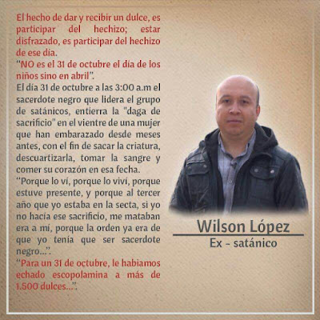

**En el Centro de Investigaciones sobre la Nueva Era (CISNE)** iniciamos nuevamente una cruzada contra **la macabra "fiesta" satánica del Halloween**. A continuación damos a usted diversas fuentes audiovisuales, auditivas y escritas para informarse mejor. Luego de ver esta información concluirá con nosotros que la "noche de brujas" es peligrosa, que sus hijos corren riesgo de sufrir asedio maligno y que debe refugiarse usted y toda su familia en los Sagrados Corazones de Jesús y de María. Así lo aseguran nuestras investigaciones como las afirmaciones contundentes de sacerdotes exorcistas y ex satanistas. 

Aquí podrás también encontrar varios videos sobre la diferencia entre celebrar el **Día de los Fieles Difuntos y no el Día de Muertos.**

<iframe width="320" height="266" src="https://www.youtube.com/embed/z7-xc1HbO-I" title="YouTube video player" frameborder="0" allow="accelerometer; autoplay; clipboard-write; encrypted-media; gyroscope; picture-in-picture" allowfullscreen></iframe>

 

<iframe allowfullscreen="allowfullscreen" webkitallowfullscreen="webkitallowfullscreen" mozallowfullscreen="mozallowfullscreen" width="320" height="266" src="https://www.blogger.com/video.g?token=AD6v5dxe51u1_4Si-sZORgjfEt9cBOFZuHWcZNB74npis6rC3XAWfPSsKPeg7CWXkP-1bP80PWKAndubaeXCldidOQ" class="b-hbp-video b-uploaded" frameborder="0"></iframe>  

 

En el siguiente video de **CISNE Radio** hablamos acerca de la nefasta influencia del Halloween en los niños, damos ideas a los papás de cómo hacer frente a esta influencia cultural y consumista, y conversamos sobre diversas actividades terroríficas en México (destinadas a lograr infestaciones demoníacas):

<iframe width="320" height="266" src="https://www.youtube.com/embed/NxQj9-mmgFs" title="YouTube video player" frameborder="0" allow="accelerometer; autoplay; clipboard-write; encrypted-media; gyroscope; picture-in-picture" allowfullscreen></iframe>

 

En esta otra liga podrá consultar otro artículo (con referencias) que publicamos en este mismo blog sobre esta "celebración" satánica mundial:[queremos halloween](/halloween-origenes)  

Acá, verá un programa especial que grabamos en CISNE Radio el año 2015:
[Halloween, Brujas, satanismo](/peligros-del-halloween)

En estos videos podrá ver las entrevista en TV a **Jaime Duarte** (Director del CISNE) y Fabián Navarro (subdirector del CISNE), que les hizo Roberto O'Farril en su programa "Ver y Creer" en 2015 como del pasado 29 de octubre de 2017:

<iframe width="560" height="315" src="https://www.youtube.com/embed/3jdxkgyMhyA" title="YouTube video player" frameborder="0" allow="accelerometer; autoplay; clipboard-write; encrypted-media; gyroscope; picture-in-picture" allowfullscreen></iframe>

 

A continuación te compartimos tres videos de una entrevista con Roberto O'Farril sobre la diferencia entre Los Fieles Difuntos y el Día de Muertos:
<iframe width="560" height="315" src="https://www.youtube.com/embed/9xY8QwGQh0E" title="YouTube video player" frameborder="0" allow="accelerometer; autoplay; clipboard-write; encrypted-media; gyroscope; picture-in-picture" allowfullscreen></iframe>

 

<iframe width="560" height="315" src="https://www.youtube.com/embed/YihUNnRU-J0" title="YouTube video player" frameborder="0" allow="accelerometer; autoplay; clipboard-write; encrypted-media; gyroscope; picture-in-picture" allowfullscreen></iframe>

 

<iframe width="560" height="315" src="https://www.youtube.com/embed/JRlammg6R8A" title="YouTube video player" frameborder="0" allow="accelerometer; autoplay; clipboard-write; encrypted-media; gyroscope; picture-in-picture" allowfullscreen></iframe>

 

Regresando al Halloween: vea o lea la declaración del ex satánico **Wilson López** y de una de las más grandes brujas en Europa, Doreen Irvine sobre el Halloween:

 

 

Demonio del Halloween habla al **Pbro. Teo** (Dirk Kurt Kranz) y revela su plan:

<iframe allowfullscreen="allowfullscreen" webkitallowfullscreen="webkitallowfullscreen" mozallowfullscreen="mozallowfullscreen" width="320" height="266" src="https://www.blogger.com/video.g?token=AD6v5dyXYVlinSrP2mROAnacpZqcSRduPNwEMJekmb8F2znW-r07l-N0_n3CCxt7MV3nXpbOfHwV6YoZWjmWKRn_DQ" class="b-hbp-video b-uploaded" frameborder="0"></iframe>

 
Declaración del Pbro. Carlos Spahn, exorcista:

<iframe width="320" height="266" src="https://www.youtube.com/embed/miil_hp9k2U" title="YouTube video player" frameborder="0" allow="accelerometer; autoplay; clipboard-write; encrypted-media; gyroscope; picture-in-picture" allowfullscreen></iframe>

 

Declaración del Pbro. Gabriele Amorth +, exorcista del Vaticano (nombrado por el Papa Juan Pablo II exorcista oficial del Vaticano en su Pontificado):

Dos videos más de los sacerdotes liberadores y exorcistas del Monasterio de Huayamón, Campeche, México:

<iframe allowfullscreen="allowfullscreen" webkitallowfullscreen="webkitallowfullscreen" mozallowfullscreen="mozallowfullscreen" width="320" height="266" src="https://www.blogger.com/video.g?token=AD6v5dwVZstrUClbvvOwhV2rTGycUkqmaUORjBx1jMmzZE7O7GuFth3BF4NLnyCim1mhKLokitifSOi5crxJLf9dIQ" class="b-hbp-video b-uploaded" frameborder="0"></iframe>

 

<iframe allowfullscreen="allowfullscreen" webkitallowfullscreen="webkitallowfullscreen" mozallowfullscreen="mozallowfullscreen" width="320" height="266" src="https://www.blogger.com/video.g?token=AD6v5dzJi8Cgnci42eF3Uwjm8p5frpGL5F3tYaI_6hi46mcR33FAa9DBsnq7mFQUl5CScTsbNGb3yOoggikx3auPSQ" class="b-hbp-video b-uploaded" frameborder="0"></iframe>

Comentario del Pbro. Ernesto María Caro, exorcista de Monterrey sobre el **"Halloween"**:

<iframe width="320" height="266" src="https://www.youtube.com/embed/fj5vesV8iQA" title="YouTube video player" frameborder="0" allow="accelerometer; autoplay; clipboard-write; encrypted-media; gyroscope; picture-in-picture" allowfullscreen></iframe>

Catequesis de **Fray Nelson:**
<iframe width="320" height="266" src="https://www.youtube.com/embed/TXd1qMNOLlE" title="YouTube video player" frameborder="0" allow="accelerometer; autoplay; clipboard-write; encrypted-media; gyroscope; picture-in-picture" allowfullscreen></iframe>

 

Compartimos finalmente con usted dos ligas para ver y escuchar un podcast y video sobre la efigie de la mal llamada "santa muerte" y comentarios igualmente sobre la "noche de brujas":

Podcast: http://www.cisne.org.mx/multimedia/podcast/?start=10 

[Articulo](/snt-muerte-aberracion)

**Oración de Santa Gertrudis para salvar a mil almas del Purgatorio**

