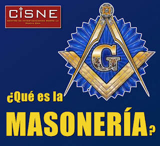

# ¿Qué es la Masonería? 
Descubre, desde la perspectiva de la fe, los misterios de la organización secreta más poderosa del mundo y enemiga No. 1 de la Iglesia Católica.

  
**Inicio:**   
¡Cuando tú quieras comenzar!  

**Dinámica:**    
El seminario estará grabado y podrás verlo ese día, u otro, en el horario y fecha de tu gusto. ¡Para siempre!   

Precio:   
$397.- (pesos mexicanos)  
$16.5 USD (dólares americanos)  

## Contenido:
¿Qué es? ¿Cuál es su origen? ¿Qué persigue? ¿Cuál es su grado de influencia? ¿Es peligrosa? ¿Qué ha dicho la Iglesia Católica de esta? Además: características, ritos y ceremonias, organización, figuras prominentes a nivel internacional y en México, grupos y asociaciones, la Masonería eclesiástica, testimonios de ex masones. Imparte: Centro de Investigaciones sobre la Nueva Era (CISNE).

Además, en la plataforma de este seminario virtual encontrarás una selección de videos y materiales adicionales que enriquecerán, todavía más, la enseñanza.

## Forma de pago:

Con tarjeta de crédito, tarjeta de débito, PayPal y por Oxxo (en México) mediante Hotmart. Ir al sitio aquí para más información y compra directa:
https://www.hotmart.com/product/que-es-la-masoneria/R22176698A 

**Bono adicional:**
En la compra de este seminario, adquiere gratis el libro en PDF: *"Geopolítica, Trilateral y Nuevo Orden Mundial: cómo Rockefeller y Brzezinski influyeron en la política exterior de EEUU y en la conformación del Sistema Internacional actual"*. Jaime Duarte Mtz. Edición propia, 380 pp. (Se dispondrá de él en el sitio del seminario). Precio: $175.- (pesos mexicanos)

¿Te interesa solo el libro? Aquí puedes adquirirlo en PDF mediante pago electrónico: https://www.hotmart.com/product/libro-geopolitica-trilateral-y-nuevo-orden-mundial/Y22209815W   

Y abrimos nuevamente el curso on line: *"¿Vamos hacia un Nuevo Orden Mundial?* Claves geopolíticas y geoestratégicas para comprender la realidad actual y próxima".  
Aquí la información  
https://go.hotmart.com/B18920708Y   