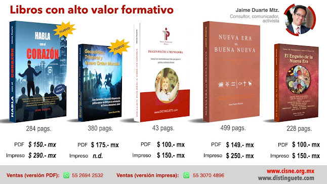

# Cómo Rockfeller y Brzezinski influyeron en la política exterior de EEUU y en la conformación del Sistema internacional actual

 

No se trata de una fábula ni de otra historia de conspiración mundial: el actual Sistema Internacional de la post Guerra Fría, aún liderado por EEUU, fue concebido e impulsado por el magnate del Chase Manhattan Bank, **David Rockefeller**, y por su estratega (cerebro) geopolítico **Zbigniew K. Brzezinski** a través de la **Comisión Trilateral** (think tank que fundaron en 1973) y de la conquista del poder político al colocar a **George Bush y a William Clinton** (miembros suyos) en la Casa Blanca. 

La presente obra es una investigación documental que revela la poderosa influencia del viejo Eastern Establishment en la política exterior de Estados Unidos de Norteamérica (de 1962 a 1997) a través de la **Comisión Trilateral**. La caída del comunismo, la reunificación alemana, la desintegración de la URSS, la Globalización, la ampliación de la OTAN al este, el TLCAN, por ejemplo, fueron objetivos alcanzados por esta poderosa élite.

Actualmente la "Trilateral" continúa su acción, pero tiene frente a sí nuevos rivales geopolíticos que amenazan el cumplimiento de sus objetivos, entre otros: ¿un nuevo Gobierno Mundial?  

¿Sabías que **George Soros** formó parte de la Comisión Trilateral?  

**Formato en PDF y en versión impresa**  

**Total de páginas:** 380

**Año de publicación**: 2009. Nueva edición: 2020

**En PDF, precio:** $ 175.- (pesos mexicanos). USD $ 9.5 (dólares americanos)  
**Forma de pago:** 
Tarjeta de crédito y débito, PayPal, tiendas Oxxo (solo en la plataforma Hotmart): 
https://hotmart.com/product/libro-geopolitica-trilateral-y-nuevo-orden-mundial/Y22209815W?draft=true  

También: https://go.hotmart.com/Y22209815W  

**En versión impresa:** $ 397.- (pesos mexicanos). USD $ 20.- (dólares americanos) más gastos de envío (SEPOMEX $ 50.- en México; de 10 a 15 días).

**Forma de pago:** solicitarlo por escrito vía WhatsApp al +52 1 55 2653 8054. Se indicará el banco y número de cuenta para el deposito.

   
**Autor**  
Jaime Duarte Mtz.  
Semblanza: https://about.me/jaimeduartemtz  

<iframe allowfullscreen="allowfullscreen" webkitallowfullscreen="webkitallowfullscreen" mozallowfullscreen="mozallowfullscreen" width="320" height="266" src="https://www.blogger.com/video.g?token=AD6v5dzO_BGHRXrnH4AXXb9F1La1pxBR9TcCWydTjgartGzQXLa1YCsNhRakJiV7P2zsiSMe_-EdLiwdfSwSFZ99kg" class="b-hbp-video b-uploaded" frameborder="0"></iframe>

   

 