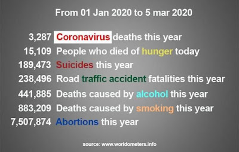

Comparto a continuación con ustedes una serie de recursos sobre el tema del llamado **Coronavirus (COVID-19)** con objeto de intentar clarificar sobre su origen, fin y medios para enfrentarlo. (Este blog estará actualizándose con más información interesante).

Desde nuestra perspectiva esta epidemia fue fabricada y obedece a un propósito siniestro que, junto con su diseño contra **China**, el asesinato de Soleimani **(Irán)** y la guerra petrolera de Arabia Saudita contra **Rusia** y el cierre del **Vaticano (la Iglesia)** buscan generar una **crisis mundial** y preparar el llamado **Nuevo Sistema Internacional ("Nuevo Orden Mundial")**. Y si no hubiese sido planeado, ¡está funcionando!

**Provocar el pánico** es parte también de la estrategia siniestra de manipulación social para acelerar los daños. Como católicos, ¿vamos a caer en el engaño? ¿Saben cuánta gente muere por otras enfermedades o males? ¡Y no se hace mucho para prevenirlo!  

## George Soros y su injerencia en Argentina y... en el covid-19 (¡Vaya seguimiento a la actuación del especulador húngaro!)

<iframe width="560" height="315" src="https://www.youtube.com/embed/qVwvLOANors" title="YouTube video player" frameborder="0" allow="accelerometer; autoplay; clipboard-write; encrypted-media; gyroscope; picture-in-picture" allowfullscreen></iframe>  

 

### Nuevo Orden Mundial: reingeniería social anti-cristiana, advierte el Dr. Pablo Muñoz

<iframe width="560" height="315" src="https://www.youtube.com/embed/dyZx58OKaZM" title="YouTube video player" frameborder="0" allow="accelerometer; autoplay; clipboard-write; encrypted-media; gyroscope; picture-in-picture" allowfullscreen></iframe>

 

### Ruby Dermestoy es clara y directa sobre el Covid-19  
<iframe allowfullscreen="allowfullscreen" webkitallowfullscreen="webkitallowfullscreen" mozallowfullscreen="mozallowfullscreen" width="320" height="266" src="https://www.blogger.com/video.g?token=AD6v5dwFJ4jodxkos7ES0NebzSOAX5znassixb5It2EPithwovZ3FOQhsjIw82rEGRAbWW2bwMY95Bje5EDVE2nIOA" class="b-hbp-video b-uploaded" frameborder="0"></iframe>

 

**¿Eucaristía en la mano? ¿Por qué? ¿Era necesario? ¿Qué han dicho los Papas, los santos y los sacerdotes que aman a Jesús Sacramentado? El "Masterplan" y "Memorias de un Antiapóstol"**
Nota: rectifica el Vaticano y comunica que las iglesias permanecerán abiertas (13 marzo): 
https://infovaticana.com/2020/03/13/roma-rectifica-y-establece-que-las-iglesias-permaneceran-abiertas/

El ex satanista Zachary King hace advertencia sobre recibir la Sagrada Comunión en la mano (a partir del minuto 2:10

<iframe width="560" height="315" src="https://www.youtube.com/embed/wxQD1HOE-3c" title="YouTube video player" frameborder="0" allow="accelerometer; autoplay; clipboard-write; encrypted-media; gyroscope; picture-in-picture" allowfullscreen></iframe>

 

### Oración, súplica a Jesús Sacramentado y medios naturales: 

<iframe allowfullscreen="allowfullscreen" webkitallowfullscreen="webkitallowfullscreen" mozallowfullscreen="mozallowfullscreen" width="320" height="266" src="https://www.blogger.com/video.g?token=AD6v5dw-9G8RFFFdDtMMVCxs0sF6QxfSO6F9lYzPxFFODMglz4Pk3AxFdb-5vcnqviJpjcYdvt8CU2idoGEjQtUDqg" class="b-hbp-video b-uploaded" frameborder="0"></iframe>  

 

### Reforzar el sistema inmunológico y evitar el pánico sugiere el Dr. Tony Morejón (médico de Trujillo, Perú):
<iframe allowfullscreen="allowfullscreen" webkitallowfullscreen="webkitallowfullscreen" mozallowfullscreen="mozallowfullscreen" width="320" height="266" src="https://www.blogger.com/video.g?token=AD6v5dwjGrTqs5SaSPUrD4CJE7hKckNVu8qWWQUowKMC6iKauNBm8Ru_6oWsiHLJHpGwTwwByfrtHrziUWOGRF9rKA" class="b-hbp-video b-uploaded" frameborder="0"></iframe>

 

### Observaciones sensatas de la Dra. Elizabeth Placencia (médico Otorringóloga, Ciudad de Guadalajara, México) quien afirma que el virus no es letal, pide evitar el pánico y brinda medidas de prevención

<iframe allowfullscreen="allowfullscreen" webkitallowfullscreen="webkitallowfullscreen" mozallowfullscreen="mozallowfullscreen" width="320" height="266" src="https://www.blogger.com/video.g?token=AD6v5dy8UMZlQ2SR32jUIBaB27qA6K7qPjG4N1pClkQBOAbanrnIqleFjolGp5eh3Hf1BIU0l1LYgekXRYdhluHjXQ" class="b-hbp-video b-uploaded" frameborder="0"></iframe>

 

###  Convocatoria nacional de oración e intercesión por los sacerdotes y las naciones para liberarlas (Acciones espirituales frente al Covid-19, el aborto, la ideología de género, la violencia, el populismo, etc.)

<iframe width="560" height="315" src="https://www.youtube.com/embed/1KcOabOU-ok" title="YouTube video player" frameborder="0" allow="accelerometer; autoplay; clipboard-write; encrypted-media; gyroscope; picture-in-picture" allowfullscreen></iframe>

 

### 10 Caminos de Mater Fátima, Pbro. Héctor Ramírez
<iframe width="560" height="315" src="https://www.youtube.com/embed/x-68WhK_XGs" title="YouTube video player" frameborder="0" allow="accelerometer; autoplay; clipboard-write; encrypted-media; gyroscope; picture-in-picture" allowfullscreen></iframe>

### Invitación: retiro para líderes con el Dr. Ricardo Castañón ("transformación interior"): ¡POSPUESTO HASTA NUEVO AVISO

 

### La Virgen María se aparece y explica cómo sanar enfermedades en Eslovaquia
<iframe width="560" height="315" src="https://www.youtube.com/embed/qhHolXvayIs" title="YouTube video player" frameborder="0" allow="accelerometer; autoplay; clipboard-write; encrypted-media; gyroscope; picture-in-picture" allowfullscreen></iframe>

### Oración (compuesta por sacerdote exorcista) que todos pueden hacer
Oh Santo Dios de Israel y Padre Celestial de la misma manera en que el Padre Abraham intercedió por la ciudad de Sodoma. Te pedimos en nombre de tu hijo amadísimo Jesucristo que envíes sobre el mundo legiones de ángeles y arcángeles acompañados de San Rafael arcángel, San Miguel Arcángel para que aten toda plaga que esté fuera de control a nivel mundial y repelen los planes malignos que Satanás tiene planeado en contra de la raza humana. Oh San Rafael arcángel has descender la medicina celestial de Dios sobre cada persona enferma, infectada, o que en estos momentos se encuentre en agonía por causa de esta pandemia que nos amenaza. Por la presencia del Espíritu Santo atamos todos los espíritus malignos, demonios, huestes espirituales de maldad, reyes de demonios, toda obra diabólica, todo plan malévolo que esté en marcha el impide con tu fuego celestial que seamos infectados por esta plaga cubiertos con la sangre del cordero de Dios nuestro Mesías y Salvador Jesuscristo.  

Pedimos la santa intercesión de todos los discípulos de Cristo, los santos, los mártires, profetas que murieron fieles al mensaje del Evangelio. Te pedimos Señor que protejas a las personas más vulnerables a esta pandemia, por tu dolorosa pasión, vida y muerte ten misericordia de nosotros y del mundo entero. Protejenos Espíritu Santo y pedimos a la santísima Virgen María que junto con santa María Magdalena intercedan ante Dios por el mundo entero. Te pedimos oh Dios que protejas especialmente a los cristianos que padecen en Europa, Asia, Oceanía, África, América y pedimos para que otorgues de sabiduría a los científicos para que pronto encuentren la cura, el tratamiento, la vacuna a esta pandemia que nos amenaza como especie.  

De la misma manera como clamó el profeta Elías en el desierto para que lloviera en medio de la sequía e hiciste descender la lluvia te pedimos Santo Dios de Israel misericordia por el mundo entero. Te pedimos especialmente por cada templo que en el mundo vaya a ser cerrado para que tus fieles no pierdan la fe en medio de tanta confusión que existe en este mundo. Te rogamos oh Dios para que evites todo caos que pueda darse o acontecer a nivel mundial y que con la espada de San Miguel Arcángel restablezcan el orden en este mundo e impidas toda acción diabólica que Satanás este ejerciendo sobre este mundo.  

Con la sangre del cordero de Dios cúbrenos de toda plaga, de toda enfermedad y forma un muro invisible que contenga todo lo malo. Con los tres clavos que traspasaron el cuerpo santo y glorioso de Cristo seamos lavados con tu infinito poder. Por el poder de la sagrada eucaristía todo mal no prevalezca sobre tu pueblo. Pedimos la intercesión del apóstol San Pedro para que ruegue a Dios por nosotros y que de la misma manera en que San Pedro declaró ante Cristo que ni las puertas del infierno no prevalecería sobre la santa iglesia que así se cumpla conforme a la declaración dicha por el apóstol de Jesucristo.  

Ven Espíritu Santo y lava nuestros cuerpos, sánalos, cúbrelos y protegerlos de todo mal llenanos de tu paz de tal manera que no nos domine el miedo, la desesperación, y que sólo confiemos plenamente en el amor, en el poder de Dios. Dios tenga misericordia de nosotros y del mundo entero. Líbranos del mal. Te pedimos todo esto por Jesucristo nuestro Mesías y redentor. Amén.  

Seguido de él Salmo 91, un Padre nuestro, un Dios te salve, un magnificat y cierra con un Gloria.  

### Comunicado de prensa de Mons. Pascal Roland, Obispo de Ars-Belley
Más que a la epidemia de coronavirus, debemos temer a la epidemia del miedo. Por mi parte, me niego a ceder al pánico colectivo y a someterme al principio de precaución que parece mover a las instituciones civiles.  

 Así que no tengo la intención de emitir instrucciones específicas para mi diócesis: ¿los cristianos dejarán de reunirse para rezar?  ¿Renunciarán a tratar y a ayudar a sus semejantes?  A parte de las precauciones elementales que todos toman espontáneamente para no contaminar a otros cuando están enfermos, no resulta oportuno agregar más.  

 Deberíamos recordar que en situaciones mucho más serias, las de las grandes plagas, y cuando los medios sanitarios no eran los de hoy, las poblaciones cristianas se ilustraron con pasos de oración colectiva, así como  por la ayuda a los enfermos, la asistencia a los moribundos y la sepultura de los fallecidos.  En resumen, los discípulos de Cristo no se apartaron de Dios ni se escondieron de sus semejantes, sino todo lo contrario.   

 ¿El pánico colectivo que estamos presenciando hoy no revela nuestra relación distorsionada con la realidad de la muerte? ¿No manifiesta la ansiedad que provoca la pérdida de Dios?  Queremos ocultarnos que somos mortales y, al estar cerrados a la dimensión espiritual de nuestro ser, perdemos terreno.  Disponiendo de técnicas cada vez más sofisticadas y más eficientes, pretendemos dominarlo todo y nos ocultamos que no somos los señores de la vida.  

 De paso, tengamos en cuenta que la coincidencia de esta epidemia con los debates sobre las leyes de bioética nos recuerda oportunamente nuestra fragilidad humana.  Esta crisis global tiene al menos la ventaja de recordarnos que vivimos en una casa común, que todos somos vulnerables e interdependientes, y que es más urgente cooperar que cerrar nuestras fronteras.  

 Además, parece que todos hemos perdido la cabeza.  En cualquier caso, vivimos en la mentira.  ¿Por qué de repente enfocamos nuestra atención sólo en el coronavirus?  ¿Por qué ocultarnos que cada año en Francia, la banal gripe estacional afecta a entre 2 y 6 millones de personas y causa alrededor de 8000 muertes?  También parece que hemos eliminado de nuestra memoria colectiva el hecho de que el alcohol es responsable de 41000 muertes por año, y que se estima en 73000 las provocadas por el tabaco.  

 Lejos de mí, entonces, la idea de prescribir el cierre de iglesias, la supresión de misas, el abandono del gesto de paz durante la Eucaristía, la imposición de este o aquel modo de comunión considerado más higiénico (dicho esto,  cada uno podrá hacer como quiera), porque una iglesia no es un lugar de riesgo, sino un lugar de salvación.  Es un espacio donde acogemos al que es Vida, Jesucristo, y donde, a través de Él, con Él y en Él, aprendemos juntos a vivir.  Una iglesia debe seguir siendo lo que es: un lugar de esperanza.  

 ¿Deberíamos calafatear nuestras casas?  ¿Deberíamos saquear el supermercado del barrio y acumular reservas para prepararnos para un asedio?  ¡No!  Porque un cristiano no teme a la muerte.  Es consciente de que es mortal, pero sabe en quién ha puesto su confianza.  Él cree en Jesús, que le afirma: "Yo soy la resurrección y la vida.  El que cree en mí, aunque muera, vivirá;  y todo el que vive y cree en mí, no morirá para siempre”(Juan 11, 25-26).  Él se sabe habitado y animado por "el Espíritu del que resucitó a Jesús de entre los muertos" (Romanos 8:11).  

 Además, un cristiano no se pertenece a sí mismo, su vida debe ofrecerse, porque sigue a Jesús, quien enseña: “El que quiera salvar su vida, la perderá;  pero quien pierda su vida por mí y el Evangelio, la salvará ”(Marcos 8:35).  Ciertamente, no se expone indebidamente, pero tampoco trata de preservarse.  Siguiendo a su Maestro y Señor crucificado, el cristiano aprende a entregarse generosamente al servicio de sus hermanos más frágiles, con miras a la vida eterna.  

 Entonces, no cedamos ante la epidemia de miedo. No seamos muertos vivientes. Como diría el Papa Francisco: ¡no os dejéis robar la esperanza!  

 