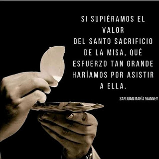
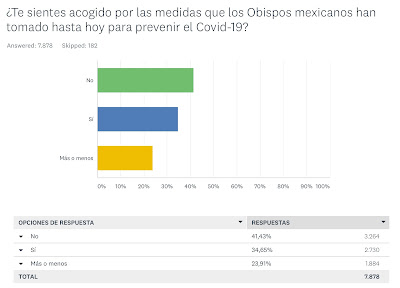
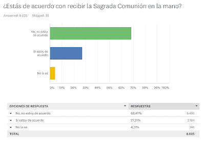
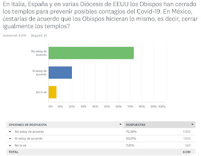
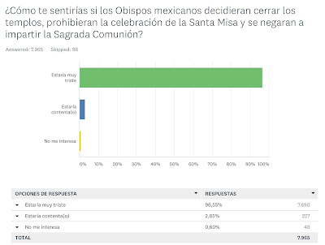

### CARTA PÚBLICA A LOS OBISPOS MEXICANOS
Comparto con mucho respeto a ustedes en este mensaje cuál es el pensar y el sentir de más de ocho mil laicos mexicanos de distintas ciudades del País sobre el impacto de las decisiones que ustedes han tomado recientemente con motivo del COVID-19.  

Se trata de un sondeo de opinión enviado el día 16 de marzo del año en curso por las redes sociales y contestado por la misma vía hasta el día de hoy martes 17 de marzo. Dicha consulta no es representativa al carecer de la metodología propia de una encuesta (conforme a los estándares internacionales al respecto, indicados por la AMAI). No obstante, deseo valoren por favor el presente ejercicio, mismo que no fue elaborado con dolo alguno ni pretensión de cuestionar públicamente sus decisiones en el ministerio que les corresponde, otorgado por Nuestro Señor Jesucristo.   

Como miembros de nuestra amada Iglesia Católica, en razón de nuestro Bautismo, los laicos entendemos perfectamente que el gobierno de la misma no se guía por aspectos "democráticos", mas queremos ser escuchados por nuestros pastores como "ovejas" a fin de ser más valorada nuestra misión y compromiso eclesial. No pocas veces nos hemos sentido solos, sin apoyo o respaldo de ustedes en nuestra labor evangelizadora diaria. Pero también, es justo decirlo, nos llena de alegría constatar en múltiples ocasiones su "olor a oveja" como ha mencionado el Papa Francisco.   

> Como ustedes saben el Canon 212 - 3 del Derecho Canónigo indica sobre los fieles: "Tienen el derecho, y a veces incluso el deber... de manifestar a los Pastores sagrados su opinión sobre aquello que pertenece al bien de la Iglesia..."

En las fotografías que se adjuntan (abajo) a este mensaje aparecen las 7 preguntas formuladas al público seglar con su correspondiente tabla y gráfica.

Como ustedes mismo apreciarán dentro de lo más significativo del sondeo levantado están los siguientes resultados:

- 78% de los laicos no está de acuerdo en recibir la Sagrada Comunión en la mano
- 72% no comparte la decisión de cerrar los templos en México como ocurre en Italia, España y algunas diócesis de EEUU
- 96% se sentiría muy triste de cerrarse los templos en nuestro País, como "prohibir" la celebración de la Santa Misa y el negar la Sagrada Comunión 
- 70% no comparte la decisión de prohibir la Santa Misa como forma de prevención de contagio
- 92% de los laicos católicos está  dispuesto a apoyarles, como a los sacerdotes, en la realización de procesiones con el Santísimo Sacramento por las calles como forma de combatir el virus
- 99% de las personas están convencidas de que Cristo Sacramentado tiene el poder para exterminar cualquier clase de enfermedad, epidemia, mal físico o mental, porque están convencidas de que es Dios 

Los seglares conscientes de nuestra fe, que nos esmeramos por ser congruentes con el Evangelio y agradar al Señor (pese a las debilidades propias del pecado) somos eucarísticos (¡México es profundamente eucarístico!). No podemos caminar sin el Pan de la Vida, sin el Cuerpo y la Sangre de Cristo; en Él reside nuestro aliento, alimento, medicina, amor, esperanza... 

Confío que esta consulta realizada por su servidor (de la cual soy el único responsable), nos brinde nuevamente la oportunidad de colaborar juntos en los apremiantes desafíos que tenemos como Iglesia y como nación mexicana. Saben que, por Gracia de Dios, cuentan con nosotros como valientes defensores de la fe, la vida y la familia.

Aprovecho finalmente la ocasión para informarles que hemos convocado hace unos días a todos los laicos a orar al Señor y a la Virgen de Guadalupe por ustedes y por nuestros amados sacerdotes (hemos empleado las oraciones del Discipulado de la Misericordia, a sugerencia del Dr. Ricardo Castañon). Pedimos a Dios Padre, a Dios Hijo y a Dios Espíritu Santo por sus necesidades, por su compromiso fiel y perseverante a su misión encomendada y por su santificación. Que Dios Todopoderoso les ilumine con su Luz de Sabiduría y Verdad en su enorme responsabilidad de conducción prudente de las almas.

Agradezco su amable y fina atención al sondeo de opinión pública aquí presentado.

Afectuosamente,

Mtro. Jaime Duarte Martínez,

Consultor en Marca Personal, Imagen y Comunicación Política (SIGNUMS - Distínguete); Director del Centro de Investigaciones sobre la Nueva Era (CISNE); Director de la Escuela Internacional de Líderes Católicos; Coordinador nacional de la defensa de los templos mexicanos.

Tel. Cel: 5526538054

También puede consultarse la carta en CISNE Informativo: https://www.facebook.com/groups/120350321701418/ 

 
  
  
 