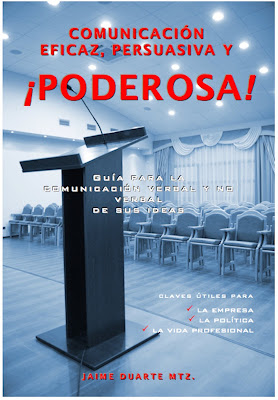

La desafiante realidad actual nos exige a todos los bautizados buscar nuevas formas de cumplir el mandato misionero del Señor: **"Id y haced que todos los pueblos sean mis discípulos..."** (Mateo 28, 19-20). *¡Ay de mí si no predicara el Evangelio!* (1 Cor. 9, 16).

A fin de cumplir esta gran encomienda y responsabilidad cristiana nuestra amada Iglesia Católica nos ha exhortado en diversos documentos y momentos (por ejemplo, en Evangeli Nuntiandi y Evangelii Gaudium) a anunciar la "alegría del Evangelio" en los distintos ambientes culturales.

Impulsar de manera más vehemente la **"Nueva Evangelización"** (en sus métodos, ardor y expresión) implica utilizar hoy, de forma creativa y efectiva, nuevos y mejores recursos; ello, sin perder, desde luego, la esencia del mensaje de Salvación.

El curso on line *"Cómo ser influencer católico"* tiene como objetivo brindar un método efectivo para ganar seguidores, lograr su confianza y ofrecer consejos prácticos que nos ayuden a emplear nuevas herramientas, técnicas y medios tecnológicos modernos de comunicación. "Ser influencer" es la nueva cara del liderazgo, enfocada correctamente al servicio de Dios y de su Evangelio.

Ante la crisis actual de la pandemia global, con el cierre total o parcial de templos católicos, la Iglesia y sus bautizados **no podemos quedarnos de brazos cruzados ni "encerrados"**. Llamados a ser "sal de la Tierra" y "luz del Mundo" debemos proseguir nuestra labor misionera en la política, en la economía, en la cultura, etc. Hoy, más que nunca, nuestros hermanos necesitan recibir el mensaje de amor, aliento y esperanza verdadera, de palabra y acción, que solo pueden dar Dios Padre, Dios Hijo y Dios Espíritu Santo.

### Curso dirigido a: 
Laicos, catequistas, agentes de pastoral, religiosos, sacerdotes, jóvenes (a partir de los 12 años de edad en adelante)

Fecha: comienza el día que gustes (está video grabado)  
Inversión: $297.- pesos mexicanos (USD $12.9- dólares aprox.)  
Duración: 4 horas efectivas   

### Medio de impartición:   
Plataforma Hotmart (toma el curso desde tu celular, tableta, PC o laptop los días y horas que gustes).   

Bono por inscripción / participación:   
Todos aquellos que se inscriben al curso reciben gratuitamente en Hotmart:
1. un libro de obsequio del expositor-autor (ver titulo abajo) en versión PDF.
2. curso gratuito de cómo usar Twitter
3. capacitación adicional sobre persuasión

Forma de pago:    
Hotmart (tarjeta de crédito, débito y Oxxo):   
Ir al sitio: https://go.hotmart.com/D35946735F   

¿Dudas?   
WhatsApp: +52 55 2653 8054 (México; días y horas hábiles)   

Perfil del expositor:  
Jaime Duarte Martínez  

* Es Maestro en Ingeniería en Imagen Pública. Consultor en Marca Personal, Imagen y Comunicación Política y Corporativa por más de 15 años en SIGNUMS y Distínguete, donde ha capacitado y entrenado a más de 17,200 estudiantes, profesionistas, empresarios y políticos sobre estos temas, así como a partidos políticos y empresas. 
* Cuenta con más de 30 años de labor apostólica, no obstante que su conversión real a la fe católica fue en el año 2001.
* Es Director fundador del Centro de Investigaciones sobre la Nueva Era (CISNE) en 2012, con la misión de informar y orientar sobre el peligro del fenómeno New Age. Recientemente el Centro se ha enfocado en arrebatarle almas al Demonio y llamar a la conversión a Dios.

### Otros cursos que también te pueden interesar

¿Vamos hacia un Nuevo Orden Mundial? Claves Geopolíticas y Geoestratégicas para comprender la realidad actual y próxima

Ver: [Más información](/geopolitica-trilateral)

¿Qué es la Masonería? Conoce a la secta secreta enemiga No.1 de la Iglesia Católica

Ver: [Más información](/que-es-la-masoneria)

Seminario: "El engaño de la Nueva Era y los Jóvenes y el ocultismo"  

Ver: [Más información](https://www.hotmart.com/product/seminario-el-engano-de-la-nueva-era-y-los-jovenes-y-el-ocultismo/X36017360E)  
Articulo Ver: [Más info](/amenazas-ocultas)   
- Libro: "Nueva Era vs Buena Nueva: la perversa trampa de la New Age contra la fe y la Iglesia". Autor: Jaime Duarte Mtz.  

Ver [más aquí](https://go.hotmart.com/V36304900B)  
