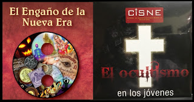

Sufre pesadillas con frecuencia?¿Escucha ruidos extraños en su hogar? ¿Baja la temperatura sensiblemente en su habitación? ¿Siente que algo se le sube al cuerpo cuando se recuesta? ¿Ve sombras en la noche? ¿Cambian los objetos de lugar en su casa sin que alguien los mueva? ¿Aulla su perro a las 3:00 AM? ¿Surgen plagas de insectos en su cocina aún tras limpiar y fumigar? ¿Aparecen moretones o heridas en su cuerpo de un día a otro? ¿Percibe olores putrefactos? ¿Observa “entes” que le miran con odio, blasfeman y lo atacan físicamente? Asimismo, en más de veinte años de investigación documental personal y de campo hemos conocido casos de extraña fractura matrimonial, ruina económica, bloqueos de la mente y la voluntad, enfermedades extrañas, muertes "accidentales" recurrentes y abandono de la fe. ¿Verdad, fantasía o imaginación?

  

A reserva de realizar una investigación espiritual y de emitir un diagnóstico adecuado en cada caso (que descarte la autosugestión, la imaginación u otro motivo natural) si usted o alguien de sus familiares han experimentado o padecen hoy día alguna de esas manifestaciones muy probablemente se debe a que incursionaron en creencias y prácticas New Age y ocultistas, las cuales “abren puertas automáticas” a la actuación de los espíritus inmundos o ángeles caídos (demonios).

 

El Centro de Investigaciones sobre la Nueva Era ofrece el primer seminario "on line" más completo y único en el mercado nacional e internacional que busca no solo orientar a los católicos (jerarquía y laicado) acerca del fenómeno sino ofrecer consejos sobre cómo salir de este engaño siniestro, peligro real y amenaza herética.

## DIRIGIDO A
Sacerdotes, religiosos, formadores, profesores, estudiantes, padres de familia, jóvenes y público en general.  

 

## FECHA DE INICIO
Hoy mismo si lo desea; está videograbado. Se ingresa el día y hora más cómodo o que se prefiera.  

## INVERSIÓN
$500.- pesos mexicanos (USD $ 20.00 dólares, aprox. Consulte tipo de cambio actual)  

 

## DURACIÓN
9 horas efectivas, más horas de material videograbado adicional.  

 

## MEDIO DE IMPARTICIÓN
Plataforma Hotmart (se puede acceder desde el smartphone, tableta, PC o laptop)  

 

## REGALOS POR INSCRIPCIÓN O PARTICIPACIÓN:

1. Libro: "Yoga ¡no!"
2. Librillo: "Guía de prácticas y creencias Nueva Era"
3. Librillo: "Nueva Era, el reto más grande para la fe en el siglo XXI"
4. "Glosario de términos y tecnicismos Nueva Era"

(Estos materiales se encuentran disponibles para su consulta y descarga en la plataforma Hotmart, donde está alojado el seminario).  

 

## FORMA DE PAGO (automático)

Hotmart, con tarjeta de crédito, débito, PayPal, American Express y en Oxxo (con código para depósito obtenido en la misma plataforma de Hotmart).  

Liga o enlace para pagar y ver el contenido del seminario: https://www.hotmart.com/product/seminario-el-engano-de-la-nueva-era-y-los-jovenes-y-el-ocultismo/X36017360E  

¿DUDAS?   
WhatsApp: +52 55 2653 8054   

 

## EXPOSITORES    
Eréndira Duarte, Rodolfo M. Rodríguez, Fabián Navarro, Jaime Duarte, miembros del Centro de Investigaciones sobre la Nueva Era (CISNE)   

### OTROS CURSOS, SEMINARIOS Y MATERIALES QUE TAMBIÉN LE PUEDEN INTERESAR

¿Vamos hacia un Nuevo Orden Mundial? Claves Geopolíticas y Geoestratégicas para comprender la realidad actual y próxima   
Ver: [Más información](/geopolitica-trilateral)   

¿Qué es la Masonería? Conoce a la secta secreta enemiga No.1 de la Iglesia Católica   
Ver: [Más información](/que-es-la-masoneria)   

Cómo ser influencer católico: 7 pasos para llevar más lejos la Nueva Evangelización
Ver: [Más información](/influencer-catolico)  

Seminario: "El engaño de la Nueva Era y los Jóvenes y el ocultismo"  
Ver: [Más información](https://www.hotmart.com/product/seminario-el-engano-de-la-nueva-era-y-los-jovenes-y-el-ocultismo/X36017360E)  
Articulo Ver: [Más info](/amenazas-ocultas)   
- Libro: "Nueva Era vs Buena Nueva: la perversa trampa de la New Age contra la fe y la Iglesia". Autor: Jaime Duarte Mtz.  

Ver [más aquí](https://go.hotmart.com/V36304900B)  

