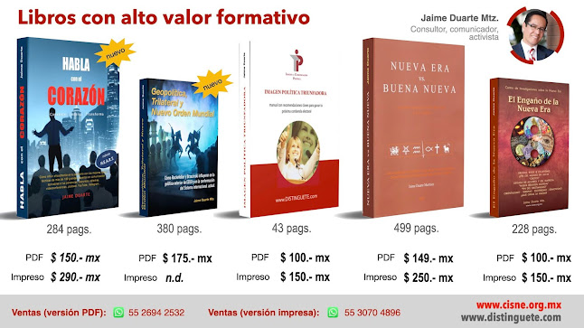

El presente documento, fruto de una **larga investigación de más de diez años** con base en reportes, notas de prensa, libros, publicaciones e informes oficiales, identifica los origenes ocultistas, los errores doctrinales y los nombres de aquellas personas y organizaciones políticas, económicas, sociales y culturales que promueven y comulgan hoy con el fenómeno denominado **New Age (Nueva Era)**. Advierte, además, sobre los enormes riesgos que sus tesis, creencias, prácticas y terapias alternativas psicofísico-místico-mágico-esotérico-espirituales suponen para sus consumidores y adeptos. En definitiva, pone en evidencia, sin rodeos ni ambigüedades, cuáles son los **peligros que tales procedimientos conllevan** para nuestra alma y cuerpo, fe y comunión con la Iglesia Católica fundada por Jesucristo.  

El libro seguramente le será de gran utilidad a modo de consulta o referencia para el discernimiento de todo aquello que forma parte del movimiento Nueva Era. Tras su estudio, como católico comprometido con Dios, con su patria, con su familia y con su comunidad, **no podrá (o más bien no deberá) permanecer indiferente** más tiempo ante esta superherejía dirigida por Satanás. Pero si no sabía nada sobre el tema, su lectura **le causará una gran conmoción** que le llevará a preguntarse seriamente si están o no usted y los suyos en el camino correcto que Nuestro Señor quiere para su vida y... su salvación.

Sin duda, una de las más amplias investigaciones en América Latina en el tema.  

**El autor**

*Jaime Duarte es Licenciado en Relaciones Internacionales por la ENEP-UNAM (Acatlán), Maestro en Ingeniería en Imagen Pública por el Colegio de Consultores en Imagen Pública (CCIP) y catedrático de la materia “Opinión Pública” en la misma institución. Tiene Diplomados en Análisis Político (IPE-UPAEP), Habilidades Gerenciales (ITESM) e Imagen Política (CCIP). Ha sido investigador y analista socio-político por más de 13 años en el ámbito laboral, cívico-político y empresarial, como también articulista en varias publicaciones y expositor en diversos foros juveniles, académicos, políticos y religiosos. Actualmente es Director de la Consultoría en Imagen y Reputación, e Imagen Política; Consejero de PROCIDS, A.C. (Instituto Mexicano de Doctrina Social Cristiana, IMDOSOC-Estado de México), y predicador católico de los Misioneros de la Sangre del Cordero.*

**Año:** 2007  
**Pags:** 499  

**Precio (formato PDF)**: $ 149.- (pesos mexicanos)  
**Ir al sitio de la venta**: [aquí](https://www.hotmart.com/product/nueva-era-vs-buena-nueva-la-perversa-trampa-del-new-age-contra-la-fe-y-la-iglesia/V36304900B)  

 

