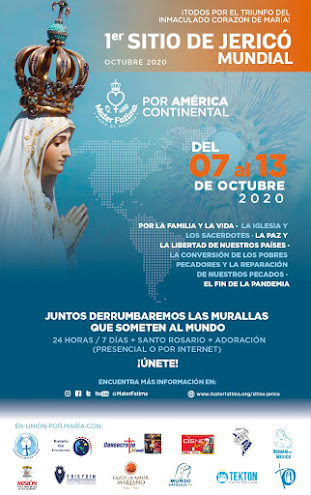

   

Descarga la guía de oraciones aquí: 
Para realizar el rezo del sitio de Jericó  
http://www.mediafire.com/file/1a7y2klmhklhzcz/SITIO_DE_JERICO_Mater_Fatima.pdf/file   

Ver también aquí
https://www.scribd.com/document/478673222/Sitio-de-Jerico-oraciones   

Visita para más información: https://www.materfatima.org  