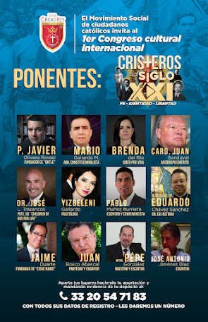

   

1er Congreso Internacional Cultural: Fe, Identidad, Libertad:
- Viernes 24/SEP, 16-20 Hrs.
- Sábado 25/SEP,  10-18 Hrs.

<iframe allowfullscreen="allowfullscreen" webkitallowfullscreen="webkitallowfullscreen" mozallowfullscreen="mozallowfullscreen" width="457" height="380" src="https://www.blogger.com/video.g?token=AD6v5dzJz4o84MXRPaCCvSMrru9e9kNr0-hh9SWFwwi9kwawoPx1_GyvDO_1xXIZlhFuPgnoU347PdTZVhYf7rZygg" class="b-hbp-video b-uploaded" frameborder="0"></iframe>  

Hacienda La Providencia, Guadalajara, Jalisco   

* Forma de registrarse y participar:

Usted podrá acceder al evento únicamente si sigue los siguientes pasos y disposiciones:  

En el FACEBOOK  DEL EVENTO (“Cristeros del Siglo XXI”) usted podrá  ver si hay disponibilidad de boletos en la modalidad que le interesa partiipar.  

* FORMAS DE PARTICIPAR   
  👉🏼 Presencial (sala principal y sala contigua)   
  👉🏼 A distancia (por internet, en Facebook)   

A. Se puede participar de forma presencial, (si hay lugares disponibles) depositando $300 pesos; incluye los dos días, como donativo en la cuenta BANORTE a nombre de:  

LOS INOCENTES DE MARIA A.C.   
Número 0606312350   
Clabe:   
072320006063123500.     

Deberá Usted depositar referenciando ese depósito como: DONATIVO a Inocentes de María más SU NOMBRE COMPLETO.     

No se hace referencia al Congreso sino que es un donativo a esa institución y su nombre completo.   

B. Se puede participar asistiendo en una sala contigua, con pantalla de leds grande (por restricciones Covid-19)  depositando $150 pesos que incluye el ingreso los dos días. El , depósito es a la misma cuenta Banorte, indicando que es un donativo y escribiendo su nombre completo. Usted podrá convivir con los expositores en las áreas comunes en los recesos.  

C. Se puede participar por internet depositando $100 a la cuenta de BANORTE arriba indicada señalando que es un donativo y escribiendo su nombre completo.  En esta modalidad le daremos acceso como "amigo" en el Facebook que se abrirá para el evento. Podrá Usted disfrutar los dos días de todas las conferencias.   

En cualquiera de las modalidades Usted deberá comprobar que hizo su depósito enviando evidencia por WhatsApp al:  

33 20 54 71 83  y al  33 11 86 60 15.  

### NO CONTESTAREMOS EL TELEFONO SI USTED LLAMA FUERA DE HORARIO DE ATENCION, de LUNES A VIERNES DE 9:00 a 14:00 HRS. NO CONTESTAREMOS POR LA NOCHE NI EL FIN DE SEMANA.

IMPORTANTE: 
AL MOMENTO DE ENVIAR SU PAGO a este número debe agregar los siguientes datos de registro:
- Nombre completo
- Ciudad donde usted vive
- Edad
- Número de celular con WhatsApp 
- Correo electrónico

Nosotros le contestaremos con el número de registro que le corresponde.  

Al llegar al evento Usted dará su número de registro y su nombre  al personal que le recibe el viernes 24 de septiembre. Trate de llegar 50 minutos antes de ser posible, esto es a las 3:10 PM. Le daremos dos etiquetas distintas, una para el viernes y una para el sábado.  

Las etiquetas de la sala presencial tienen un color distinto al de la sala con pantalla.   
Tendremos venta de comida el sábado y servicios de café, postre, agua y botanas (ambos días).  

Deberá llevar su cubre bocas y seguir las indicaciones que se le den.   
OTRAS INDICACIONES IMPORTANTES:   

NINGÚN OTRO CONTACTO PUEDE PEDIRLE DEPOSITAR EN NINGUNA OTRA CUENTA. ¡NO SE DEJE ENGAÑAR!

Le recomendamos no llevar niños pequeños porque puede ser muy cansado para ellos y distraerían la atención.   

No podrá apartar lugares, eso queda estrictamente prohibido.   

Usted se compromete al enviar su donativo de recuperación a ser respetuoso con el personal voluntario de orden.   

Puede contactarnos también por correo electrónico a italclas@hotmail.com  

**ATENTAMENTE**  
**MOVIMIENTO SOCIAL CATÓLICO ¡VIVA CRISTO REY!**   
**COMITÉ ORGANIZADOR**   

*Atención:*
SI A USTED NO LE GUSTA LEER INSTRUCCIONES NI SEGUIRLAS, ESTE CONGRESO PROBABLEMENTE NO ES PARA USTED  

