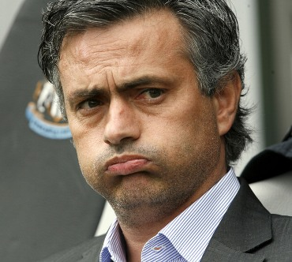

# Mourinho estuvo de vacaciones con su familia en Kenia y ahí acudió con los brujos

Por AFP
Nairobi, Kenya (18 julio 2010).- El entrenador portugués del Real Madrid, José Mourinho, acudió a varios brujos kenianos para que le ayuden a triunfar en el club español, al que llegó esta temporada proveniente del Inter de Milán, aseguró uno de ellos.

Mourinho estuvo de vacaciones en Kenia con su familia a principios de julio y se reunió con cuatro brujos de la región de Ukunda, en la costa sur del país.

"Nos reunimos con él a través de un intermediario en un lugar secreto", dijo Mzee Makthub, un chamán de reconocido prestigio que suele aconsejar a políticos y autoridades del futbol de la región.

"Nos pidió que le ayudáramos a triunfar en su nuevo trabajo. Mourinho dijo que empezaba una etapa difícil en el Real Madrid y que quería ganarse el respeto de la gente con la que iba a trabajar", añadió Makthub, quien considera normal la petición del portugués.

**José Mourinho entrenó por primera vez a su nuevo equipo el viernes.**