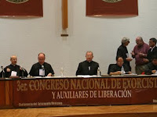

**El exorcista jefe del Vaticano, Gabriele Nanni, visitará México para participar en el Congreso de Exorcistas 2010, donde psicólogos, médicos y religiosos discernirán sobre la delgada línea que separa la enfermedad mental y la «posesión por los espíritus malignos». De acuerdo con Pedro Mendoza Pantoja, exorcista coordinador, en el curso se expondrán los avances y descubrimientos más recientes en el ámbito de la lucha contra el maligno.**

De acuerdo con la Coordinación General de Exorcistas de la Arquidiócesis de México, presidida por el sacerdote Pedro Mendoza Pantoja, en el Congreso se espera clarificar “los tenebrosos oficios del mal y las estrategias para conocerlo y combatirlo”.
Precisó que “los diputados y gobernantes se han vuelto un instrumento del maligno al aprobar leyes que generan el desorden moral y lesionan a la sociedad (…) la denigración de la dignidad humana es manifestación de la presencia del maligno que se ve reflejado en leyes como el aborto y las uniones entre personas del mismo sexo”.

El crimen organizado, agregó, es “un reflejo del demonio porque no se explica esos extremos de violencia, de crueldad, de maldad con el prójimo (…) el diablo existe y no actúa como en la película del exorcista, sólo en casos muy aislados”.

*Para aclarar diferencias entre la acción demoniaca y enfermedades mentales se tendrá la participación de psiquiatras y especialistas en ciencias biológicas; así se pretende clarificar las sutiles diferencias en las influencias malignas, sugestiones, opresiones, manifestaciones y, en el peor de los casos, la posesión demoniaca*, refirió.

Al Congreso también asistirá el vicepresidente de la Asociación Internacional de Exorcistas, Ernesto María Caro. De acuerdo con Pedro Mendoza Pantoja, exorcista coordinador, en el curso se expondrán los avances y descubrimientos más recientes en el ámbito de la lucha contra el maligno.

