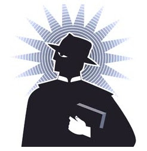

# Publica Iglesia compendio de prácticas demoníacas
**Señala que el ocultismo provoca que las personas padezcan distintos fenómenos, como enfermedades inexplicables o ver muertos**

La Arquidiócesis de México publicó el manual “Líbranos del mal” dirigido a sacerdotes exorcistas; en éste se ofrece una catequesis sobre la figura de Satanás y una recopilación de las prácticas demoniacas más comunes en el Distrito Federal.

El sacerdote Félix Pérez Rodríguez, autor del texto, explica que es necesario orientar a los curas en estos tiempos en que se incrementa el número de personas que se involucran en prácticas de ocultismo y esto los convierte en víctimas de terribles sufrimientos porque experimentan fenómenos sin ninguna explicación.

Dichas anomalías pueden ser ver siluetas, sombras u objetos que se mueven solos; padecer enfermedades inexplicables; escuchar ruidos; sentir que los persiguen, o llegar a ver personas que han muerto.

Y advierte que muchas personas han fallecido al ser provocadas por las “artes maléficas”, otras han sido internadas en hospitales psiquiátricos o terminan por destruir sus familias y matrimonios.

En el manual se explica qué tipo de trastornos puede causar el demonio en las personas y cómo se pueden defender.

En el tema “las acciones extraordinarias” señala que el demonio puede causar sufrimiento físico y en la posesión demoniaca los hace actuar y hablar a la persona como el demonio quiere, sin que ésta pueda resistirse. Además, explica otros fenómenos cono la vejación y la obsesión diabólica que no llegan a la posesión, pero que hieren cruelmente a la persona.

Para defenderse de estos males el sacerdote enlista las acciones básicas a seguir por los católicos: vivir en gracia con Dios, orar continuamente, acudir al sacramento de la reconciliación, llevar una vida cristiana, así como recurrir a Jesucristo, a la virgen María y los Santos.

En el manual se establece que el exorcismo mayor sólo lo puede realizar el obispo o un sacerdote especializado, mientras que el exorcismo menor u oración de liberación y de sanación lo pueden realizar otros curas.

Félix Pérez Rodríguez, sacerdote exorcista, destacó que en estos tiempos en que **el culto a la Santa Muerte y a la Santería**, que confunden a tantos católicos y dañan su espíritu, es importante que los sacerdotes dediquen tiempo para orar con sus fieles.

Pero la labor de ser el responsable de la pastoral del exorcismo en la Arquidiócesis lo ha llevado a crear un equipo de oración integrado por 13 personas.

Explicó que su tarea es auxiliar al sacerdote en la oración para liberar a las personas que sufren ataques demoniacos. Estas personas, destacó, fueron seleccionadas después de cursos y pláticas y son las idóneas porque reunieron las siguientes características: piadosas, sabias, prudentes y de una vida íntegra.

En los últimos años la Conferencia del Episcopado Mexicano y la Arquidiócesis de México han organizado diversos encuentros sobre exorcismo, a fin de preparar sacerdotes y laicos para combatir “las fuerzas del mal”, que se han hecho presentes en la violencia que se registra en México.