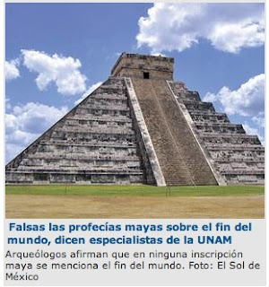

# Es cuento que el mundo se acabará en el año 2012

Ciudad de México.- El 22 de diciembre de 2012 no se acabará el mundo ni ocurrirá una catástrofe; tampoco existe alguna profecía maya al respecto, como se ha divulgado por medio de afirmaciones sin sustento científico, advirtieron especialistas del Centro de Estudios Mayas (CEM) del Instituto de Investigaciones Filológicas (IIFl) de la UNAM.

María del Carmen Valverde Valdés, coordinadora del CEM, aclaró que en su calendario los mayas no describieron una profecía, sino el término de un ciclo de 13 bactunes, equivalentes a cinco mil 125 años, y el inicio de otra etapa.

Un bactún es una unidad de tiempo maya equivalente a 144 mil días del calendario occidental; multiplicada por 13 bactunes, esa cifra arroja un ciclo de cinco mil 125 años, que concluirá el 22 de diciembre de 2012.

Entonces, acabará un período y comenzará otro, sin que ningún glifo se refiera al fin del mundo o de la humanidad. No existe nada así en las inscripciones de esa cultura, precisó por su parte Tomás Pérez Suárez, también investigador del CEM.

El 22 de diciembre de 2012 en el ciclo calendárico maya terminará un ciclo de cinco mil 125 años y comenzará uno nuevo, pero en ninguna inscripción se menciona que vaya a ser el fin del mundo, reiteró el arqueólogo.

Si se cierra una etapa de 13 bactunes, inicia otra igual, y es lo único que va a suceder; los mayas jamás hablaron del Apocalipsis, de destrucción ni de cataclismo.

Valverde Valdés señaló que esa cultura tenía una noción circular del tiempo, lo que significa que la historia en algún momento se repetirá, explicó la también historiadora y doctora en Estudios Mesoamericanos.

Para ellos, cuando se escriben los anales se hace una profecía, pues es una concepción cíclica donde los hechos se repiten; si se habla de sus vaticinios, en realidad se trata de lo que registraron de su propia historia, en una forma de escritura -la del maya yucateco- que es siempre críptica y simbólica, precisó.

El calendario maya se ha estudiado y descifrado desde finales del siglo XIX, entonces, se comenzó a desarrollar una analogía de las fechas de los calendarios maya y occidental. "En esa correlación hay varias discrepancias entre investigadores, que van de días hasta años", indicó.

*Fuente: Nota íntegra de Guillermo Ríos / El Sol de México, 2 enero 2011*