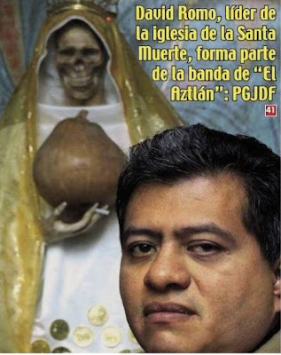

**El procurador capitalino, Miguel Ángel Mancera, precisó que David Romo Guillén recibió 25 mil pesos por prestar a los plagiarios una cuenta bancaria para depositar el rescate por dos adultos mayores.**

México.- La procuraduría capitalina detuvo al autodenominado obispo de la Iglesia de la Santa Muerte, David Romo Guillén, y a nueve presuntos integrantes de una banda de plagiarios que se hacían pasar como Zetas. El presunto líder, Gabriel Israel Peralta Martínez, El Spiderman, operaba desde la Penitenciaría de Santa Martha.

El titular de la dependencia, Miguel Ángel Mancera, dijo que los implicados participaron en el plagio de una pareja de adultos mayores que se perpetró en la delegación Magdalena Contreras, el 14 de diciembre pasado.

Señaló que existe evidencia de la participación de Romo Guillén (quien en 1997 fue exhibido por la Arquidiócesis de México como falso sacerdote dedicado a defraudar) en el cobro de rescate del matrimonio, cuyo dinero fue transferido a una cuenta a nombre de su alias: Silverio Reyes Fremain Cortés.

*Fuente: Milenio Diario, 5 enero 2011. Foto: La Prensa*