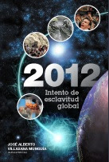

**... los alarmistas hablan del “fin del mundo”, mientras que los esotéricos hablan del paso a una “nueva conciencia”, y de una “transición espiritual”..." "en realidad se trata de eventos cósmicos naturales, que sin duda tendrán que ver con el inminente Retorno de Jesucristo...**

A medida que nos acercamos al solsticio de invierno del 2012 crece la especulación, derivando o bien en indiferencia escéptica, por parte de algunos, o en preocupación alarmista, por parte de otros.

Los primeros días del 2011, varios periódicos desplegaron la noticia de que el 2010 ha sido el año “récord” en desastres naturales (950 calamidades, siendo la media de 615 en los últimos treinta años). Algunos de esos diarios mencionan previsiones de que en los siguientes dos años se conservará la tendencia a incrementarse. Y no están equivocados, un equipo de científicos de la NASA, dedicado a calcular las consecuencias que tendrá la gran alineación cósmica del 21 de diciembre de 2012, afirma que habrá grandes perturbaciones atmosféricas.

Pero ¿de qué estamos hablando, y qué nos dice nuestra Fe?

Lo que ocurrirá en el solsticio de invierno de 2012, y está sucediendo ya, si bien en menor escala, será consecuencia de un simple y sencillo acontecimiento sideral: la alineación de la Tierra con el Sol, el cual se superpondrá con el ecuador de la Vía Láctea. Pero los alarmistas hablan del “fin del mundo”, mientras que los esotéricos hablan del paso a una “nueva conciencia”, y de una “transición espiritual” hacia una “nueva civilización”. Ambos están equivocados y juegan con la ignorancia de la gente.

El hecho de que ambos grupos de charlatanes proclamen el “fin del mundo” o el “fin de la civilización actual” se basa en que el Calendario Maya, el cual calculó admirablemente todas estas conjunciones, termina el 21 de diciembre de 2012. No sigue más.

Efectivamente, el Calendario Maya (conocido como “Códice Dresde” porque se conserva en la Biblioteca Estatal de la Ciudad de Dresde, en Alemania), incluye extraordinarios cálculos de la rotación de la Tierra, de su traslación alrededor del sol, así como del movimiento de precesión de los equinoccios y, más admirable aún, del movimiento de traslación elíptica de nuestro sistema solar dentro de la galaxia. Ese periodo, llamado “Cuenta Larga”, dura 25,625 años, y concluye el 21 de diciembre de 2012.

**Por José Alberto Villasana**

[Sitio web del autor](http://www.ultimostiempos.org/)

