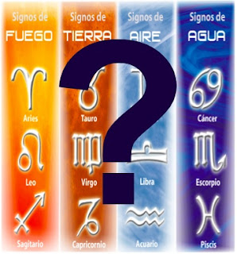

# Nuevo signo zodiacal cuestiona nuevamente los horroróscopos

**El nuevo signo “Ofiuco” (“el portador de la serpiente”) propuesto la semana pasada por el profesor de astronomía** de la Universidad Técnica y Comunitaria de Minneapolis, **Parke Kunkle**, resquebraja el endeble sistema de creencias astrológicas en Occidente y conmociona a sus creyentes. ¿Por qué?

**Un nuevo cálculo en la órbita de la Tierra redefine el número de los doce signos del Zodiaco; ahora serían trece;** el planeta ya no está alineado con las estrellas en la misma posición que cuando los signos fueron creados. “Ofiuco aparece desde hace tiempo en el cielo y el sol pasa desde hace miles de años por el portador de la serpiente”, señaló Kunkle. Así, a los nacidos entre el 29 de noviembre y el 17 de diciembre ¡les corresponde Ofiuco y no Sagitario! como se creía, afirmó el profesor.

**El consecuente reordenamiento en la carta astral ha provocado que miles de personas sufran una fuerte crisis existencial y de identidad** pues se niegan a aceptar –naturalmente- que el signo según el cual les correspondía conforme a las fechas de su nacimiento, ¡nunca lo fue! Todo el modelo que habían erigido al respecto –pensemos en el signo zodiacal como una forma usada comúnmente por ellos para ser exitoso y tomar decisiones como buscar trabajo o encontrar el amor- ¡estaba equivocado desde su origen!

**Ante semejante confusión y conmoción, los astrólogos agrupados en la Federación Estadounidense de Astrólogos han salido a consolar a sus clientes y a negar rápidamente la aceptación de este signo.** ¡Claro! Tenían que evitar que el jugoso negocio valuado en miles de millones de dólares se les fuera de las manos. (Eso sí, nunca aclaran por qué en un mismo día, en un mismo signo zodiacal, existan en los medios de comunicación diferencias abismales en su interpretación).

**Trátese de occidental o china, la astrología es una forma de superstición y adivinación** muy antigua y no una ciencia, como sí lo es, en cambio, la Astronomía. Por ello se comprende que en la década de los ‘70 (¡hace 40 años atrás!) más de 192 científicos en Estados Unidos, entre ellos 19 Premios Nobel, ¡la condenaron!

**Del mismo modo, los profetas del Antiguo Testamento condenaron unánimemente la misma, como una forma de adoración a los planetas**. Por ejemplo, **Moisés** reprendió a su pueblo cuando adoró al becerro de oro (dios astrológico Taurus); **Jeremías** rechazó la adoración a la luna (7,18; 44,17-25); **Isaías** advirtió de calamidades al Rey de Israel  por consultar a los astrólogos (47,11-14), y **Ezequiel** condenó a los hombres de Israel por adorar al sol (8,16) y a las mujeres por “endechar a Tamuz” (8,14). La luna era Venus, El sol era Baal (deidad fenicia) y Tamuz o Adonis introdujo la adoración a los siete planetas y a los doce signos del Zodíaco. Además de estas deidades, los judíos llegaron a adorar a Aries (la cabra) y al dios astrológico Moloc (representaba también al sol y se le hacían sacrificios humanos). Es decir, la astrología era una forma de politeísmo y estaba prohibida por **Moisés**, ya que sólo debía consultarse y adorarse al único Dios, Yahvéh.

**Dios mismo reprobó la participación de Israel en la astrología de forma muy dura, y su postura, hoy, no ha cambiado**; se extiende a nuestro tiempo y al mundo entero: “No ha de haber dentro de ti nadie que haga pasar a su hijo o a su hija por el fuego, que practique la adivinación, la astrología, la hechicería o la magia ningún encantador, ni quien consulte espectros o adivinos, ni evocador de muertos. Porque todo el que hace estas cosas es una abominación para Yahvé tu Dios …” (Deuteronomio 18, 9-14).

Lamentablemente se ha venido menospreciado su Palabra, pero ésta no dejará de cumplirse (leer Lucas 21, 35).

**El Catecismo de la Iglesia Católica señala a propósito en el numeral 2116**: “Todas las formas de adivinación deben rechazarse: el recurso a Satán o a los demonios, la evocación de los muertos, y otras prácticas que equivocadamente se supone ‘desvelan’ el porvenir. La consulta de horóscopos, la astrología, la quiromancia, la interpretación de presagios y de suertes, los fenómenos de visión, el recurso a ‘mediums’ encierran una voluntad de poder sobre el tiempo, la historia y, finalmente, los hombres, a la vez que un deseo de granjearse la protección de poderes ocultos. Están en contradicción con el honor y el respeto, mezclados de temor amoroso, que debemos solamente a Dios.”

**Con razón el Papa Juan Pablo II dijo al respecto**: “La ignorancia en el campo religioso es aprovechada frecuentemente por grupos esotéricos o por sectas para atraer a los fieles poco arraigados en su fe”.

**Católico: ¿En qué estás poniendo tu confianza? ¿En Cristo? o ¿Acuario?**
Fuente: Elaboración propia con base en el libro “Nueva Era vs. Buena Nueva”, y El Universal, 15 enero 2011 
[Checar aqui](www.eluniversal.com.mx/sociedad/6813.html)

Véase el mismo artículo en el periódico "El Mensajero", 6 marzo 2011, No. 72, órgano de la Provincia Eclesiástica [Tlalnepantla, Edo. Mex.](http://issuu.com/tierradeenmedio/docs/mensajero_72)

