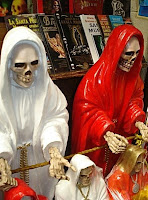

# Santa muerte, culto aberrante y opuesto a Dios

Como quiera que se le llame (“La Comadre”, la “Santa Patrona”, “la Niña Bonita”, “La Niña Santa”, la “Santísima”, “La Flaca”, “La Señora de las Sombras”, o la “Hermana Blanca”), el culto a la denominada “Santa Muerte” es una aberración, un grave error; es una nueva forma de idolatría y paganismo, muy detestable a los ojos de Nuestro Señor Dios.

Para el Pbro. Eleazar Franco Niño y el poeta Homero Aridjis sus antecedentes se remontan a las tradiciones prehispánicas (Olmecas, Zapotecas, Purépechas, Mayas, Toltecas y Mexicas) y a la Colonia donde la muerte ocupaba un lugar primordial en la mentalidad y la forma de conducta del hombre de ese tiempo.
- Para el Pbro. Flaviano Amatulli, en cambio, los elementos con los cuales se le presenta “son más bien de la cultura griega, como son el manto, la túnica, la gudaña y el reloj de arena”.
- para el Pbro. Heliodoro Díaz López se trata de una falsa diosa pagana llamada Orishás (“espíritu africano de un demonio”). En la santería se le adora y se le llama Oyá, “diosa de las centellas, de los vientos, de las guerras, dueña de los panteones”.

Cualquiera que sea su origen, ha sido la denominada “Iglesia Católica Tradicional México-USA” la secta que en el barrio de Tepito le ha dado “culto público” y ha estado envuelta en diversos litigios y escándalos. Por ejemplo, en abril de 2005 la Secretaría de Gobernación le retiró su registro porque se apartó de sus estatutos. En enero de 2008 el falso sacerdote y autonombrado “Obispo” David Romo, líder de dicha “iglesia”, pidió a la SEGOB clausurar el templo de la “Santa Muerte” en Tultitlán (porque le hacía competencia y deseaba hacerse del llamado “Santuario Nacional de la Santa Muerte”). En marzo de ese año, Romo “validó” en su templo las uniones homosexuales, y en agosto Antonio Urrieta (llamado “Comandante Pantera Padrino Endoque”, rival de Romo y líder del culto en Tultitlán donde levantó una efigie de 22 metros) fue asesinado tras recibir más de 100 disparos. El 4 de enero de este 2011 la PGJDF detuvo a Romo por formar parte de una banda de secuestradores; el ministro se encargó de cobrar el rescate de un matrimonio.

Por cierto, ¿sabía usted que en 2007 David Romo le cambió el nombre e imagen física a la efigie? En agosto de 2007 la “canonizó” como “Ángel (exterminador) de la Santa Muerte”; dejó el esqueleto y la guadaña por la figura de una mujer maquillada, de vestido dorado y coronada. Al respecto, relato lo dicho por el Pbro. Daniel Gagnon: la “Hermana Blanca” o el “espíritu del Exterminio” que el Libro del Éxodo (capítulo 12) “es la santa muerte” que los espiritualistas invocan vía mediúmnica en su cátedra el 2 de noviembre.4

No obstante su cambio de look, en ninguna parte del santoral católico aparece esta ni nunca ha sido “canonizada” por la Iglesia Católica. Además, Amatulli precisa: “No puede existir tal culto porque la muerte no es un ser ni una criatura, pero lo más importante es que no es un dios ni la esposa de Dios, como sus adeptos consideran”. Y el Pbro. José de Jesús Aguilar añade en el órgano Desde la Fe: “Al final de los tiempo la última en ser vencida será la muerte. ¿Cómo, entonces, vamos a llamar a la muerte ‘Santa’? El culto a la Muerte es finalmente el culto al adversario de Cristo, es el culto del padre del pecado”.5 La Palabra de Dios es clara cuando nos dice: “Amarás a tu Dios con todo tu corazón, con toda tu alma y con toda tu mente. Este es el mayor y primer mandamiento” (Mateo 22, 36-38). “Yo, el Señor, soy tu Dios, que te ha sacado del país de Egipto, de la casa de la servidumbre. No habrá para ti otros dioses delante de mí” (Éxodo 20, 2).

Así, ante esta devoción macabra, nuestra Iglesia Católica predica un Evangelio de vida, de esperanza y de victoria, no un mensaje de muerte, violencia y derrota. Nos invita amorosamente a dejar estas formas de ocultismo y satanismo para convertirnos a Cristo, quien nos dice: “Yo Soy el camino, la verdad y la vida” (Juan 14, 6). Porque Jesús venció a la muerte con su gloriosa Resurrección (Romanos 5, 17); la muerte es consecuencia y castigo del pecado de nuestros padres (Génesis 2, 17); quien no ama permanece en la muerte (Juan 3, 14); el pecado engendra la muerte del alma (Efesios 2, 5), y el que cree en Jesucristo será resucitado también y vivirá eternamente (Juan 5, 24; 6, 40, y 11, 25).

1 Pbro. Eleazar Franco Niño, *El más grande error religioso de nuestro tiempo en México: El ‘culto’ a la ‘Santa’ Muerte*, Secretariado Diocesano de Evangelización y Catequesis de la Arquidiócesis de Puebla, s/Ed., Puebla, 2006, p. 28-29.  
2 (Citado en)[http://www.catolicodigital.com/content/view/4496/101]  
3  R.P. FR Heliodoro Díaz López, Saj. *La Santa Muerte, un culto no católico y sin fundamento religioso*, s/Ed. (impresos La Paz), México, s/a, p. 4.  
4 Pbro. Daniel Gagnon, *Limpias y Espíritus chocareros*, Ed. Basilio Núñez, México, 1998, p. 42.  
5 Pbro. José de Jesús Aguilar, *‘Santa Muerte’, ignorancia, confusión e idolatría”*, Desde la Fe, Semanario Católico de información, del 23 al 29 de septiembre de 2007, año X, No. 552.  