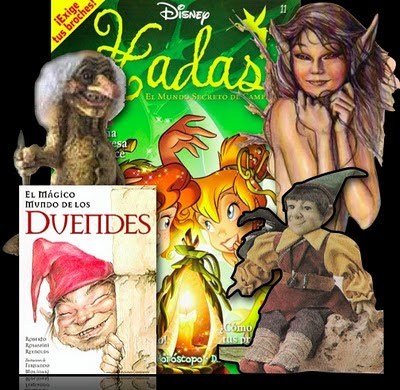

# No a los elfos, trolls, hadas, gnomos, duendes, dubilachos

**Ante las constantes preguntas sobre las figuras, muñecos y peluches de duendes, elfos, trolls, stitches, etc. que los niños compran y poseen, se hace muy conveniente decir lo siguiente:**

1. **Dubilachos**
    Son más de 50 figuras de hilo o estambre, pequeñas, en forma de demonios, brujas, asesinos, monstruos, etc. que tienen como finalidad -según sus creadores- dar buena suerte, combatir las envidias, dar seguridad, defenderse de los ataques o hasta hacer daño a quien se lo causó. Van dirigidos a los niños y, según, sus creadores, están hechos según el "método Vo-doo (Vudú) de magia blanca".
2. **Stitches**
    Les llaman "Tus amigos del otro lado del bosque". Son figuras también, pero de madera, que afirman son para la buena suerte. Son pequeños, en forma de demonios, santa muerte, vampiros, asesinos, etc. Se dice que vienen de Egipto.
3. **Espíritus de la naturaleza" también conocidos como elfos, aluxhes, duendes, sirenas, gnomos o trolls.**
    un origen mitológico según la cultura que así los considera, pero también encuentro que en mis investigaciones que pueden llegar a tener otros orígenes espirituales y sobrenaturales, aunque esto sea racionalmente difícil de creer:
     * Cargados o hechizados para hacer males, o bien, perturbar: hablar, comer, hacer travesuras, moverse, cambiar de lugar, caminar en la noche.
     * Chamanes o brujos que le piden al Demonio permiso para convertirse en esos seres y molestar
     * espíritus malignos que adquieren estas formas, y que el Enemigo pone al servicio de brujas, chamanes, hechiceros, santeros, etc.

En el siguiente link encontrará lo dicho por el Instituto de Salud Mental de Jalisco, respecto de los daños o patologías que encontró en aquellos niños que los compran o poseen:
[http://www.scribd.com/doc/47291227/Espiritus-de-la-naturaleza-Elfos-duendes-gnomos-trolls]

Hay videos que hablan sobre el tema:  
<iframe src="https://www.facebook.com/plugins/video.php?height=420&href=https%3A%2F%2Fwww.facebook.com%2Fmiguelsanchezavila.org%2Fvideos%2F415902248444197%2F&show_text=false&width=560&t=0" width="560" height="420" style="border:none;overflow:hidden" scrolling="no" frameborder="0" allowfullscreen="true" allow="autoplay; clipboard-write; encrypted-media; picture-in-picture; web-share" allowFullScreen="true"></iframe>

**LE RECOMIENDO QUE DESTRUYA ESTOS SERES O FIGURAS SI LOS TIENE EN CASA (RÓMPALOS Y QUÉMELOS), ¡NINGUNO ES BUENO, AUNQUE SE DIGA QUE SON DE LUZ, DE DINERO O AMOR!**

Use guantes para destruirlos, esté usted en gracia de Dios, báñelos antes con agua bendita, ore y cante a Nuestro Señor en el momento de destruirlos, y las cenizas tírelas al caño. Pida perdón a Dios por haberlos tenido en casa, aún por ignorancia.

Revise, finalmente, el siguiente link donde pongo los distintos símbolos, signos, amuletos y objetos que la New Age usa y recomiendo para supuestamente hacerse uno de poderes, fuerza o conocimientos esotéricos. Destrúyalos igualmente como los trolls, elfos, aluxes, etc.:
**[http://www.scribd.com/doc/47292435/Simbolos-y-objetos-que-usa-y-difunde-la-NewAge]**

Espero que la información sea de su utilidad y tome cartas en el asunto.