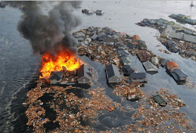

# Juan Pablo II dijo 'los océanos inundarán continentes enteros'. Cita, a propósito del desastre en Japón

**Desconcertantes declaraciones del Papa Juan Pablo II, cuando respondió a algunas preguntas importantes hechas por un número muy limitado de periodistas durante su viaje a Alemania (del 15 al 19 de noviembre de 1980), a la ciudad de Fulda:**

## Pregunta: ¿Santo Padre, qué es el secreto de Fátima? ¿Ya debía haberse publicado en el año 1960?
**Respuesta:** Por su contenido impresionante y para no animar a la fuerza mundial del comunismo a ciertas injerencias, mis predecesores prefirieron hacer un »informe diplomático» del secreto. Además, debería bastar a cada cristiano cuanto sigue: cuando se lee (en el secreto) que **los océanos inundarán continentes enteros, que a los hombres se les arrebatará la vida de repente, en minutos, y a millones de ellos...** , sabiendo esto, verdaderamente no es necesario pretender que se publique este secreto... Muchos quieren saber sólo por curiosidad, pero olvidan que el saber lleva consigo responsabilidades...; ellos quieren solamente satisfacer su curiosidad. Esto es peligroso cuando, en semejante tiempo, no se quiere hacer nada alegando que ya no sirve de nada.

**En aquel momento, el Papa, mostrando la corona del Rosario, afirmó: »¡He aquí la medicina contra este mal! ¡Rezad, rezad y no preguntéis más! El resto preguntádselo a la Virgen**   

Después de haber respondido a una pregunta sobre dar la Comunión con la mano, se le hizo al Papa una última y definitiva pregunta en relación al secreto de Fátima:  
## ¿Cómo irán las cosas en la Iglesia?  
**Respuesta:** Debemos estar bien preparados ante próximas y grandes pruebas, que incluso pueden requerir el sacrificio de nuestra vida y la entrega total a Cristo y para Cristo... Las pruebas podrán ser reducidas con vuestra y nuestra oración, pero ya no pueden evitarse, ya que sólo de este modo podrá llegar una verdadera renovación de la Iglesia, como ya otras muchas veces la Iglesia renació en la sangre... No será diferente esta vez.  