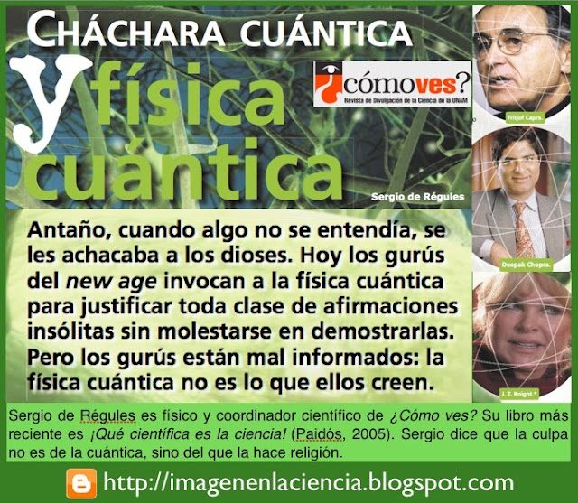

# Ciencia cuestiona de la "energía" mística New Age

El científico mexicano **Sergio de Régules**, vuelve a echar por debajo la ridícula tesis de las "energías" (místicas) de la nueva era (esas que se cree erróneamente se pueden 'cargar' el 21 de marzo, por ejemplo, o que se pueden enviar como señala Raquel Levinstein en su libro "El perdón, una onda cuántica de libertad") y, claro, de la utilización insolente de "lo cuántico" de sus adeptos **(Chopra, Knight, Capra, etc.)** para intentar justificar por la Ciencia sus charlatanerías. No se diga la famosa y absurda **"ley de la atracción"** de Rhonda Byrne.

De este modo la acupuntura, la **digitopuntura**, el **biomagnetismo**, el **reiki**, los **chakras**, los **nadis energéticos** y otras tantísimas terapias psico-físico-espirituales provenientes de oriente e impulsadas por el gobierno de Estados Unidos en la década de los '60 (para distraer a los jóvenes de los problemas sociales y políticos, y evitar una desestabilización interna buscada por los soviéticos) y muy de moda hoy, quedan en entredicho.

**¡ABRE LOS OJOS Y... PIENSA!**

