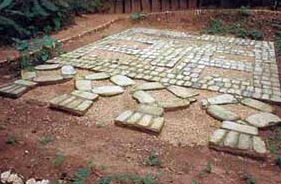

# Especulaciones, las profecías mayas sobre el fin del mundo

VILLAHERMOSA, Tab., 29 de marzo (apro).- La sexta y última estela del calendario de la cultura maya, conocida como monumento 6  y encontrada por el poeta Carlos Pellicer en el cerro El Tortuguero, en el municipio de Macuspana, no anuncia el fin del mundo como se especula en distintas partes del orbe, aclararon especialistas.
Al presentar y describir la  inscripción, los expertos desmintieron que la piedra rescatada por Pellicer en 1958 haga referencia al fin del mundo  y al comienzo de una nueva era a partir del 23 de diciembre de 2012.
El delegado del **Instituto Nacional de Antropología e Historia** (INAH), Juan Antonio Ferrer Aguilar, explicó que la piedra hace mención a los combates, victorias y otros  sucesos vividos por el gobernante Balam Ahau  en el siglo VII d.C.
En una de las partes conservadas, apuntó, se alude  a la fecha y el polémico descenso de Bolom Yokté, dios de los nueve pasos, asociado con la creación del universo y quien anuncia una nueva era.

El texto anterior nos recuerda la "aldea apocalíptica" que un grupo de italianos edifica al sur de Yucatán, México, "contra eventuales catástrofes naturales, como incendios e inundaciones" bajo la creencia de que algo pudiera pasar en 2012 según la profecía maya.

*Ver la nota íntegra en El Universal, 21 de noviembre de 2010:[aqui](http://www.eluniversal.com.mx/estados/78698.html)*