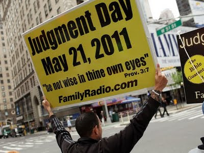

# "¿Fin del mundo el 21 de mayo? ¡Ja, ja!"

**Ya pasaron 5 días del llamado "Fin del Mundo" y, ya ven, no pasó nada. Aquí estamos, como decimos en México,"vivitos y coleando".**

Eso sí, hubo toda clase de expresiones y manifestaciones fútiles y dramáticas en el mundo occidental. Todo para enfrentar o evadir el supuesto "juicio final" programado en el calendario.  

Pero, si bien es comprensible que la sola mención de la destrucción de nuestro planeta o la aniquilación total de la vida no es un asunto menor y estremece a la mayoría de los seres humanos, es necesario precisar varias cosas:

**1. El llamado "fin del mundo" es un tema recurrente cada vez que inicia o termina un nuevo siglo, milenio o década.** Existen innumerables casos de charlatanes que presagian -sin ningún fundamento- toda clase de calamidades ¿Ejemplos? Marshall Applewhite en 1997 (de la secta Heaven's Gate = "Puerta del Cielo"; se suicidó con sus 39 adeptos porque consideraba que su cuerpo espiritual se salvaría de la destrucción total y abordaría así la nave extraterrestre que viajaba detrás del cometa Hale-Bopp).

**2. El tema del "fin del mundo" es usado como pretexto para fundar grupos, asociaciones o movimientos pseudoespirituales o religioso**s cuyos líderes -autonombrados "salvadores"- han terminado por traicionar su propia causa y abusado de sus propios miembros. ¿Casos? David Koresh (de la secta de los davidianos; se inmoló con sus 54 fieles adultos tras enfrentar con armas de alto poder a la policía en el rancho de Waco, Texas, en 1993. El tipo se creía el "Mesías"; tuvo 21 hijos con sus mujeres. Todos murieron en la refriega y calcinados).

Y hay líderes de sectas que, incluso, llegaron a anunciar la llegada de Cristo en el nuevo milenio (1900), para lo cual ordenaron a su gente les construyeran una casa digna (grande y ostentosa) para recibirlo como se merecía. Por supuesto que el hijo de Dios no llegó y tales dirigentes se quedaron con toda la propiedad.

**3. La llegada del "fin del mundo" es calculada, defendida y promovida principalmente por sectas protestantes de sesgo apocalíptico y grupos New Age.** El caso de la supuesta destrucción del planeta, la semana pasada, provino del pastor cristiano Harold Camping, quien aseguró en su programa Radio Family de California -y lo reiteró a CNN- que un "terrible terremoto" comenzaría el sábado 21 de mayo y, luego de 153 días tras una serie de eventos, el orbe eventualmente se destruiría (el 21 de octubre de este año).

Camping aseguró que el "Día del Juicio" era resultado de su cálculo matemático basado en varios datos de todos los eventos bíblicos pasados. El pastor ya había "profetizado" el "fin del mundo" en 1994.

Además de algunas sectas cristianas, **los creyentes en la llegada astrológica de la "Era de Acuario" pertenecientes al movimiento Nueva Era, insisten que el 2012 será el comienzo del fin** de todo cuanto existe luego de que un gran meteorito destruya la Tierra (según las antiguas profecías mayas). Aunque existen versiones encontradas aun entre sus miembros, la mayoría apunta a que el 12 de diciembre de 2012 (12/12/12) la humanidad entera experimentará un "despertar de conciencia", una "iluminación universal", un "cambio espiritual". Como se aprecia, no se ponen de acuerdo: unos creen que pereceremos y, otros acuarianos más, que los astros nos cambiarán. ¡Pamplinas!

Ya he expresado mi punto de vista al respecto de esta visión New Age en otros artículos aquí publicados.

**4. La "salvación" de la supuesta destrucción planetaria, sostienen no pocos, vendrá de los astros o de los extraterrestres.** En efecto, diversas obras publicadas por destacados new agers como indiqué, difunden la tesis creciente de que cierta alineación de los planetas traerá consigo la paz, el amor, las "buenas vibras", etc. Es decir, basan firmemente su optimismo en el "cambio universal de conciencia" tras el reacomodo de los astros. En otras palabras, se trata de una interpretación subjetiva basada en la astrología (una forma de adivinación antigua censurada por Dios). Así, dicen, "Piscis" cedería su lugar al signo "Acuario".

A este último respecto, la letra de **la canción "Aquarius, let the sun shine"** de Valeria Lynch -popularizada hace 40 años- señala precisamente cómo los astros guiarán la paz del mundo.

Y, recientemente, vemos cómo en las películas de Indiana Jones, ET, Transformers o 2012 (esta última protagonizada por John Cusack) los alienígenas "buenos" vienen a salvar a la Humanidad. Claro, hay otras tantas cintas donde los extraterrestres, por el contrario, intentan aniquilarnos sin piedad: Independence Day, Marcianos al ataque, Invasión extraterrestre, La Guerra de los Mundos, entre otras.

Hay un lunático llamado Rael, fundador de la secta de los raelianos (que mezcla religión, pseudociencia y creencia en OVNI's) que está actualmente buscando clonar a Cristo para salvarnos; para ello tomaría parte de su sangre de la Sabana Santa y así lo "reencarnaría".

**5. Nuestra postura como católicos sobre el tema del "fin del mundo" debe partir de las siguientes consideraciones:**

* No es posible establecer una fecha específica sobre el "fin del mundo". ("Nadie sabe el día ni la hora").
* No es lo mismo "fin del mundo" que el "fin de los tiempos" o "últimos tiempos" (que ya estamos viviendo).
* Jesús en el Evangelio de San Mateo (Capítulo 24, versículo 3), señala los sucesos que habrán de suceder en los "últimos   tiempos": falsos cristos, guerras, escasez de alimentos, grandes terremotos, falsos profetas, aumento de la maldad en el mundo. El profeta Daniel y los cuatro evangelistas señalan, además, que habrá una "Gran Tribulación", "cual no la hubo desde el principio del mundo" (Mt 24,15). Y el apóstol san Juan indica en el Apocalipsis, menciona la aparición en este tiempo del "Anticristo" (que el Catecismo de la Iglesia Católica, por cierto, reconoce en el numeral 675) en cuyo gobierno habrá una "impostura religiosa". En fin... [Ver](http://www.vatican.va/archive/ESL0022/__P1V.HTM)
* Los católicos que creemos por la Fe que Jesús, el Hijo de Dios, habrá de venir con gran poder y majestad a juzgar al mundo y a establecer su Reino de Justicia y Amor, hablamos más bien de la **"PARUSÍA"** (que significa manifestación, y significa la segunda venida triunfal de Cristo).

El teólogo católico e internacionalista **José Alberto Villasana**, en su libro "Parusía: el inminente retorno de Cristo" (México 2006, Ed. Abacar, p. 4) , afirma que Jesús vendrá para realizar tres cosas: 1. derrotar al "Anticristo", así como al "falso profeta" y a quienes impusieron un Gobierno Mundial anticristiano; 2. juzgar a las naciones y llevar a cabo la primera resurrección, y 3. restaurar la creación y elevar la naturaleza humana en su integridad. [Ver](http://www.ultimostiempos.org)

* Por tanto, como podemos apreciar, aunque no es posible asegurar cuándo sucederán estas cosas, el Evangelio sí nos da pistas ("signos") sobre el comienzo y "fin del mundo".
* Como fieles católicos debemos estar atentos a estos acontecimientos, en oración constante, alegres y con esperanza, porque el regreso de nuestro Salvador, Redentor, Liberador, sucederá.

**CRISTO escucha la llamada de auxilio de su esposa (la Iglesia) cuando -en medio de tanta perversidad y oscuridad- toda ella clama: "Maranatha" ("Ven Señor Jesús") o "Cristo Rey nuestro, venga tu Reino".**

