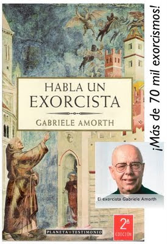

# El exorcista Amorth a Lucifer: "¿Por qué te da tanto miedo Juan Pablo II?

**El mundo tiene que saber que Satanás existe**  

He tenido dos respuestas distintas, ambas interesantes», relata el exorcista de la diócesis de Roma, de 86 años de edad y unos 70.000 exorcismos en su haber.
El padre **Gabriele Amorth**, sacerdote exorcista de la diócesis de Roma (Italia) y uno de los más conocidos del mundo, señaló a ACI Prensa que el ahora Beato Papa Juan Pablo II se ha convertido, en los últimos años, en un poderoso intercesor en la lucha contra el demonio.  

El Padre Amorth tiene 86 años de edad y unos 70.000 exorcismos en su haber. Lo primero que dijo en la entrevista es que **"el mundo tiene que saber que Satanás existe**".  

En su pequeña y sencilla oficina en la zona sureste de Roma en donde ha llevado a cabo miles de exorcismos, el sacerdote contó que a veces invoca la ayuda de santos hombres y mujeres, entre los que destaca **Juan Pablo II**, beatificado por el **Papa Benedicto XVI** el pasado 1 de mayo en Roma ante un millón y medio de fieles.

Durante los exorcismos, contó el sacerdote a ACI Prensa, "le he preguntado al demonio más de una vez: ‘¿por qué te da tanto miedo Juan Pablo II?’ Y he tenido dos respuestas distintas, ambas interesantes"  

## La caída del comunismo y la salvación de los jóvenes
La primera, **‘porque desarmó mis planes’**. Y creo que con eso se refiere a la **caída del comunismo en Rusia y en Europa del Este**. El colapso del comunismo".
"Otra respuesta que el demonio me dio fue **‘porque arrebató a muchos jóvenes de mis manos’**. Hay muchos jóvenes que, gracias a Juan Pablo II, se convirtieron. Tal vez algunos ya eran cristianos pero no practicantes, y luego con Juan Pablo II volvieron a la práctica".  

Al ser preguntado sobre el intercesor más efectivo de todos, el P. Amorth contestó a ACI Prensa sin dudar: **"por supuesto que la Virgen** es la más efectiva. ¡Y cuando la invocas como **María!**".  

## ¿Por qué te asustas más cuando invoco a María?
Una vez le pregunté a Satanás. ‘¿pero por qué te asustas más cuando invoco a Nuestra Señora que cuando invoco a Jesucristo?’ Me contestó porque me **humilla más ser derrotado por una criatura humana que ser derrotado por Él'**.  

El sacerdote dijo también que es importante la intercesión de los que aún viven a través de la oración. Los cristianos pueden rezar por la liberación de un alma, uno de los tres elementos que ayudan en este proceso a los que se suman la fe y el ayuno.  

El Señor les dio a ellos (los Apóstoles) una respuesta que también es muy importante para nosotros los exorcistas. Dijo que para vencer al demonio se necesita mucha fe, mucha oración y mucho ayuno: Fe, oración y ayuno.  

El padre Amorth dijo además que en la lucha contra el demonio es necesaria "especialmente la fe, se necesita mucha fe. Muchas veces también en las curaciones, Jesús no dice en el Evangelio soy yo quien te ha curado. Dice, en vez de eso, estás curado por tu fe. Quiere fe en la gente, una fe fuerte y absoluta. Sin fe no puedes hacer nada".  

## Los cuatro poderes extraordinarios del demonio
El sacerdote miembro de la Sociedad de San Pablo explicó luego a ACI Prensa que "el diablo y los demonios son muchos y tienen dos poderes: los ordinarios y los extraordinarios".  

"El poder ordinario es la capacidad de tentar al hombre para distanciarlo de Dios y llevarlo al infierno. Esta acción se realiza contra todos los hombres y las mujeres de todo lugar y religión".  

Sobre los poderes extraordinarios, el padre Amorth indicó que estos se concentran en una persona específica y existen cuatro tipos:  
La **posesión demoníaca** para la cual se requiere un exorcismo, la **vejación demoníaca**, como la que sufrió en reiteradas ocasiones el Santo Padre Pío de Pietrelcina que era golpeado físicamente por el demonio; las **obsesiones** que llevan a la persona a la desesperación; y la **infestación**, que es cuando el demonio ocupa un espacio, un animal o incluso un objeto.

El sacerdote alertó que estos hechos son poco frecuentes pero están en aumento. También manifestó a ACI Prensa su preocupación por la cada vez mayor cantidad de jóvenes que son afectados por Satanás a través de las sectas, las sesiones de espiritismo y las drogas. Pese a ello no se desalienta.  

"Con Jesucristo y María, Dios nos ha prometido que nunca permitirá tentaciones más grandes que nuestras fuerzas", apuntó.

## "Breve guía" para la lucha contra el demonio
Finalmente en la entrevista el padre Amorth propuso una breve guía a tomar en cuenta en la lucha contra Satanás:  

"Las tentaciones del demonio son vencidas primero que nada **evitando las ocasiones**, porque el demonio siempre busca nuestros puntos más débiles. Y luego, con la **oración**. Nosotros los cristianos tenemos una ventaja porque tenemos la Palabra de Dios, tenemos la oración y podemos rezarle al Señor", concluyó.  

*Fuente: ACI, 18 mayo 2011*