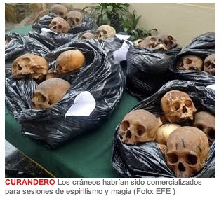

**Las calaveras servían para sesiones de espiritismo y magia y eran comercializadas por el curandero, Augusto Cisneros Quispecondori, de 31 años de edad.**

La policía peruana se incautó hoy de 180 cráneos humanos que estaban en poder de un curandero, que fue detenido en el centro de Lima.

La Policía Nacional informó que las calaveras servían para sesiones de espiritismo y magia y eran comercializadas por el curandero, Augusto Cisneros Quispecondori, de 31 años de edad.  
El chamán fue detenido y la policía informó que investiga la procedencia de los cráneos.  

La policía también informó que confiscó productos "sin licencia sanitaria" para su venta, polvos supuestamente mágicos que comercializaba el curandero.  

En el local donde se encontraron los cráneos había un altar en el que, supuestamente, se llevaban a cabo los extraños rituales del chamán, según la policía.   