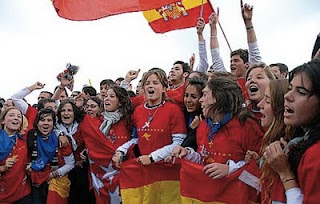

# Jóvenes y tiempo libre: Una JMJ frente a las sectas y la magia  
Siguiendo con los artículos sobre jóvenes y nuevas religiosidades, publicados para la agencia de noticias Zenit, columna ésta dirigida por Luis Santamaría del Río, sacerdote experto en nuevas religiosidades y miembro fundador de la Red Iberoamericana de Estudio de las Sectas (RIES), les ofrecemos la última aportación. Puede consultar el resto de artículos a partir del siguiente enlace.

El autor del artículo de hoy es Vicente Jara Vera, dominico seglar, miembro de la Red Iberoamericana de Estudio de las Sectas (RIES).

Si hablamos de juventud y de sectas, pensamiento mágico, Nueva Era, etc., hemos de profundizar en las actividades que realizan los jóvenes. A veces a los adultos se nos olvida que los jóvenes no usan del tiempo libre o de ocio como nosotros.  

  

En general en todas las encuestas y en todos los países (nos referimos siempre al primer mundo), los jóvenes tienen como primera actividad (1) el salir con los amigos, siendo la segunda (2) el escuchar música. A partir de este dato se producen las variaciones, pues los varones apuntan en tercer lugar (3) el deporte, que suele ser también grupal preferentemente. [Dar click aquí para ver más](https://info-ries.blogspot.com/2011/07/jovenes-y-tiempo-libre-una-jmj-frente.html).