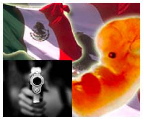

# La violencia en México... va a aumentar. Pbro. Juan Rivas, L.C.  
Esto lo vengo diciendo desde el día en que México votó por el aborto, por la violencia contra gente débil e indefensa.  

El problema de la violencia, ciertamente, tiene muchas cabezas, y trae cola. Pero la violencia nace en un cultivo social donde la sociedad no quiere saber nada de Dios o ya no tiene tiempo para Él.  
**Los narcos no se reproducen por esporas, sino en la nata de una sociedad pagana, materialista, atea**, de familias descompuestas, madres golpeadas, hijos sin padre ni madre, avaricia, ambición, ambientes de los antros y los casinos y todas mis amigas y amigos de la infancia se excusan diciendo que tienen derecho a hacer con su dinero lo que les venga en gana. ¡Adelante! pero esto y mucho más, es parte del "cultivo", de la "sopa primordial" donde nace la violencia.  

**El año en que todo el pueblo de Guadalajara salió en peregrinación con el Santísimo desde Zapopan hasta la catedral, la violencia bajó casi a cero.** "Una sociedad que excluye a Dios camina hacia la autodestrucción" (Ben. XVI).

**El problema de México más que social es espiritual.** Si no hacemos una consagración de familia por familia, de pueblo por pueblo y de ciudad en ciudad, lo dije desde el 2007 y lo repito en el 2011 la violencia va a aumentar. Se trata de hacer algo parecido a lo que hizo San Francisco en Arezzo, donde todos se mataban a todos, hasta que invitó a un diácono para hacer un exorcismo mientras él rezaba públicamente en la calle.

**Si no salen todos los obispos, sin miedo, por las calles, de ciudad en ciudad con el Santísimo y/o la imagen original se saca de la Basílica y se cierra ésta, como se hacía en tiempos de la peste, (porque había fe y no miedo) la violencia no se va acabar.**

**Nosotros le hemos dado fuerza al demonio y sólo El más fuerte podrá devolverlo (s) al abismo de donde salió el día en que México votó por el aborto**, en la misma ciudad donde la Virgen está embarazada. México votó contra su Hijo. **La Virgen está muy triste.**

Al menos consagremos nuestros hogares al Corazón Inmaculado de María y busquemos que en mi parroquia se haga adoración una vez por semana 24 horas seguidas, una hora por familia. Si lo hacen esos barrios y esas familias estarán protegidas contra la violencia. En Cristo…”