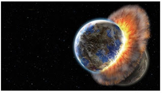

# 2012: "Despertar", III Guerra Mundial, colapaso financiero y cisma en la Iglesia
Muchos hablan del 2012 sin saber del tema. Los alarmistas lo relacionan con el “fin del mundo”, los esotéricos lo refieren a un indefinido pero muy fascinante “salto cualitativo de la conciencia” hacia una vaga “era de luz” de la humanidad. La mayoría permanece dubitativa, constatando que, efectivamente, hay signos que señalan cómo la humanidad se adentra a una etapa, amarga y esperanzadora, del todo inédita.  

 

## Solsticio de invierno de 2012
La fecha del 21 de diciembre 2012 no representa el fin del mundo, sino la alineación cósmica del eje central de nuestra galaxia, con nuestro sol y el planeta Tierra. Esa alineación sucede cada 25,625 años, dentro de un gran movimiento de traslación del sistema solar dentro de la galaxia, y provoca una serie de alteraciones climatológicas fruto, entre otras causas, del multiplicarse de explosiones volcánicas submarinas y del consecuente incremento de humedad atmosférica. Dicha alineación, que los mayas y los egipcios calcularon con admirable precisión, provoca también una variación en las ondas electromagnéticas que llegan a la Tierra. Pero, desde luego, no tiene nada que ver con el fin del mundo. Después de esa fecha, la humanidad continuará por al menos 1,007 años más, como veremos.  

**"Despertar", III Guerra Mundial, colapso financiero y cisma en la Iglesia...**

*por José Alberto Villasana*  
*Fuente:* **Golgotaonline**, Revista electrónica mensual, 17 diciembre 2011.  