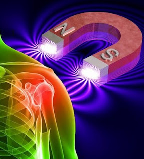

# Biomagnetismo o magnoterapia, el regreso de un viejo fraude
También llamado magnetismo en el mundo de la medicina alternativa, es, explican, “el tratamiento de enfermedades mediante el uso de campos magnéticos. Estos campos magnéticos pueden ser producidos por imanes permanentes o electroimanes, los cuales pueden tener un campo magnético variable. El término magnetos e imanes se usa de forma indistinta”. La técnica consiste en pasar imanes por todo el cuerpo, por uno de los miembros, o bien, colocarlos temporalmente a modo de muñequeras, rodilleras, cinturones o cintas para la cabeza. Su origen data del siglo XVIII cuando el médico alemán Franz **Anton Mesmer** empezó a difundir su doctrina del **“magnetismo animal”**.  

Creía que existía una **energía** general y común a todos los seres vivos. Según él, “el hombre está unido al universo mediante un flujo que actúa como lo hace el magnetismo entre dos masas metálicas. Las enfermedades serían resultado de una mala repartición o del debilitamiento de dicho fluido. De la misma manera que puede imantarse un cuerpo metálico frotándolo con un imán, Mesmer pensó que era posible **‘energetizar’** al individuo sumergiéndolo en un **baño energético universal**. Al principio recurrió a imanes que pasaba sobre el cuerpo del paciente para su **‘reenergetización’**, efectuando así pases doblemente **mágicos**. Pero se dio cuenta de que los imanes no desempeñaban más que un papel ilusorio”. Luego, “magnetizó” el agua de un estanque y, después, lo sustituyó por una cubeta. La Facultad de Medicina investigó la técnica y la prohibió. Posteriormente, el electricista **Kirlian** (1950) y el profesor **Rocard** (1960), continuaron por separado con esa tesis de Mesmer; este último admitió –como buen científico— que no era posible sacar una conclusión definitiva sobre el uso de los imanes en medicina.  

Según la definición de Littré, “es un procedimiento mediante el cual se puede llegar a provocar en el cuerpo humano una serie de manifestaciones equiparables a las que tiene un imán”. El magnetismo es base esencial de varias terapias alternativas, inspiradas igualmente en la noción de la “energía” del hinduismo. Entre éstas: magnoterapia, masoterapia, biomagnetismo, terapia pránica, digitopuntura, etc.  

Fue **Friederich** (Franz) **Anton Mesmer** (1733-1815), médico alemán, el creador de la teoría ocultista del “magnetismo animal” (pronunciada dos siglos atrás por Paracelso). “Sostuvo que en todo cuerpo viviente existe un ‘fluido magnético’ en el cual circula una fuerza especial animando al mundo orgánico como al inorgánico”; se trataba de un “campo de energía magnética invisible que rodea a la persona”. Creía que las personas dotadas de un poderoso espíritu vital (“magnetismo animal”) podían ayudar a los necesitados utilizando la imposición de manos a fin de que las ondas emanaran de sus dedos. Asimismo, “trató de relacionar la astrología con la medicina y practicó el hipnotismo como medida terapéutica. Parece documentado que mantenía con cierta regularidad reuniones espiritistas”. Su tesis es similar a la de Reich, sobre la “energía orgón”.

Pero los análisis científicos de sus tesis realizados por la **Academia francesa de Medicina** resultaron muy negativos, forzándolo a retirarse de la vida pública (incluso fue desterrado del país). Formó discípulos en Francia que fundaron la Sociedad de la Armonía Universal en 1872.  

El 4 de agosto de 1956, la **Sagrada Congregación del Santo Oficio** (hoy Doctrina de la Fe), dirigió una carta a todos los obispos sobre la licitud o ilicitud del magnetismo. En ésta, les encargaba la vigilancia acerca de los abusos en las prácticas del mismo y de las supersticiones mezcladas frecuentemente con ellas, muchas de las cuales, especialmente la pretendida evocación de los espíritus, son las mismas en las que incurren los espiritistas.  

Por tanto, descarte la pretendida curación con imanes y manos de chamanes o terapeutas; no funciona, y si ocurriese, ¡cuidado!, porque no viene de Dios sino del Maligno que simula efectuar milagros fugaces para extender su obra. Ahora bien, Dios Uno y Trino, en su infinita bondad y misericordia, puede usarnos como instrumentos para sanaciones de enfermos mediante la “imposición de manos”, pero es algo que debe hacerse poniéndo a Cristo primero, con fe en su bondad y poder, y estar apoyado con oraciones de intercesión. Pidamos que siempre sea Él quien cure y se haga su santísima Voluntad en el enfermo (“Señor, si quieres, puedes curarme”; Marcos 1, 40-45). Nosotros, por sí, no tenemos ese poder para hacerlo, ni mucho menos las piedras (litoterapia, gemoterapia) e imanes, ¡recuérdelo!  

