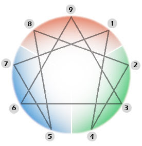

# ENEAGRAMA, ¿método de crecimiento espiritual?
Hace tiempo cayó en mis manos un volante, en el cuál se me garantizaba que tomando un **curso de Desarrollo Humano** para conocerse a sí mismo podría yo adquirir un perfecto balance e integridad personal. Muy tentador alcanzar ese balance e integridad por lo que durante toda mi vida he luchado, y que no siempre he tenido éxito.  

Este curso según el **volante publicitario**, marcaría mi vida. Quedó en mi cabeza dando vueltas esa idea, ¿cómo en tres días (9 horas) **podría yo lograr un crecimiento espiritual?** Si durante muchos años me he dedicado a este crecimiento espiritual, tanta oración, formación, vida sacramental, y aún sigo sintiendo que avanzo lentamente. ¡Que bueno haber encontrado una solución instantánea a mis inquietudes!  

Pronto surgió una ráfaga de luz en mi mente. **¿Dónde entra Dios en este curso?** ¿Si es un curso de crecimiento espiritual como es que no se menciona la oración, la Eucaristía, la Meditación, mi relación personal con Dios?

**El Eneagrama** se presenta como un “método de crecimiento espiritual”para “conocerse a uno mismo”, según los arquetipos de la personalidad, fue popularizado en el occidente por **Georges Ivanovich Gurdjieff** (1870-1949) y por su discípulo Pier D. Ouspensky, en los años 60’s por Oscar Ichazo.

Desde muy joven, el armenio Gurdjieff, buscaba afanosamente el conocimiento **esotérico, el ocultismo, la comunicación con los muertos, la magia, las sociedades secretas**.

Así mismo enseñaba que el eneagrama es un símbolo universal del Cosmos basado en leyes matemáticas: "todo conocimiento puede ser incluido en el eneagrama y con ayuda de este puede ser interpretado".  

Posteriormente, **Oscar Ichazo**, llamado padre del moderno eneagrama, fundador del Arica Institute, en Nueva York (1971), que ayudo mucho a su difusión, en alguna ocasión comentó: **"En el eneagrama, no hay lugar para Jesús, lo dije a unos sacerdotes y deberían haber estado atentos, porque no hay ningún Jesús que encontrar aquí"**. (cfr Tori de Angelis "Jesús was a 2)" en Common Boundary, vol 13, No 5 1955, 55-59).
**Fue Ichazo el que introdujo en el eneagrama la correlación de sus nueve puntos con nueve tipos de personalidad.** Cada persona nacería como "esencia pura", pero para sobrevivir se encuentra forzada a desarrollar una personalidad que será su ego. Entre los 4 y los 6 años, escoge uno de los nueve patrones básicos de pensamiento que está conectado con un patrón de comportamiento. Esta personalidad escogida **es la causa de la infelicidad**. Entonces para ser feliz, la persona debe regresar a su esencia, compensada por su "fijación del ego". Esto se logra cultivando el patrón de pensamiento y comportamiento opuesto y complementario al suyo. **Debe hacer ejercicios especiales como meditación con la posición de las manos al estilo budista (mudras).**

Como **nada de esto tiene fundamento en la razón, Ichazo dijo haber descubierto los tipos de personalidad del eneagrama durante un éxtasis y bajo influencia de un ángel.**